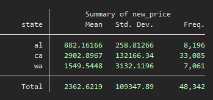
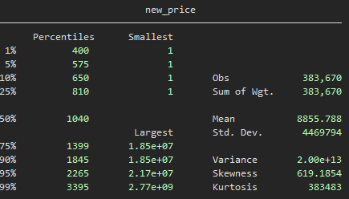
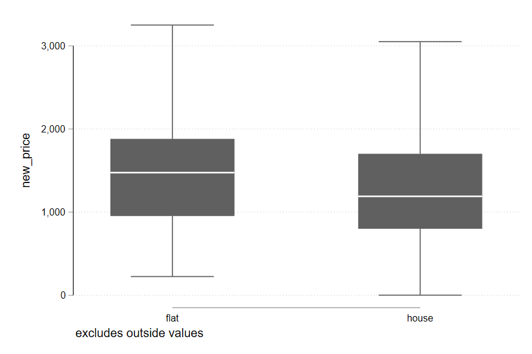
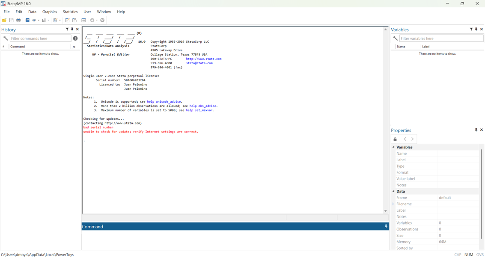
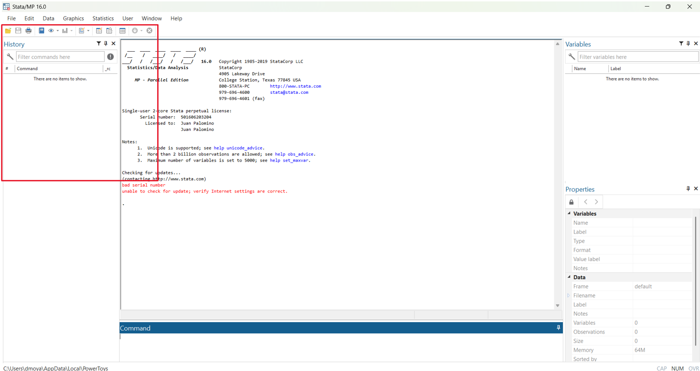
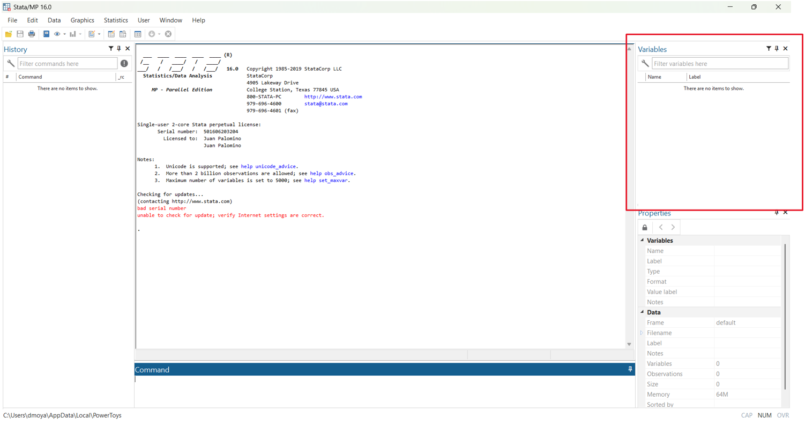
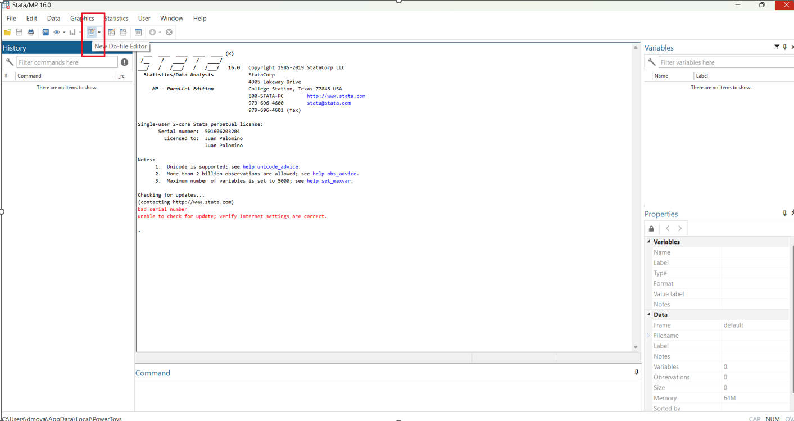

# {{ config.site_name }}

---

## Introducción a STATA

!!! info  "¿Por qué es útil usar STATA para el análisis de datos?"

Cuando estamos realizando análisis de datos es muy común trabajar con bases de datos grandes.

Para estos casos programas como Excel que muestran los datos en una hoja de cálculo dejan de ser tan útiles, ya que pueden manejar una capacidad limitada de información y tienden a ser más lentos.

!!! tip "Programas estadísticos"

Por este motivo es necesario buscar otras alternativas. Aquí entran programas estadísticos, como por ejemplo `STATA`, aunque existen otras alternativas como `R` y `Python`, los cuales son más usados, ya que son gratuitos.

!!! question "¿Qué ventajas tiene STATA sobre Excel?"
    - [x] Nos permite trabajar con bases de datos grandes

    - [x] Tiene facilidad para generar estadísticas (muy importante para economistas)

    - [x] Hay mayor cantidad de gráficos para visualizar información

    - [x] Tenemos mayor control sobre las fórmulas y los datos (a diferencia de Excel)
    -- esto es muy útil para mantener el orden al trabajar

Si quiere comparar el rendimiento de ambos programas con una base de datos grande puede descargar el siguiente archivo con información de casas usando este
[link](https://www.kaggle.com/datasets/austinreese/usa-housing-listings)

La base de datos pesa cerca de 500 MB y tiene 384 980 observaciones

---

## Ejemplo

En este ejemplo se muestra una de las principales ventajas de usar STATA

!!! danger "Generar estadísticas descriptivas"
    Usando solo un comando podemos generar una tabla que nos resuma el precio promedio de las casas según el estado al que pertenecen, así como la desviación estándar y el número de observaciones.

{text-align=center}

Como puede ver hay 48 342 observaciones, un número muy grande y posiblemente más difícil de realizar en Excel

!!! danger "Estadísticos más complejos"
    STATA cuenta con comandos predeterminados donde nos podemos ahorrar mucho trabajo a la hora de analizar datos.

{align=center}

En este ejemplo se muestra como con un comando obtenemos una tabla con diferentes medidas de dispersión, como el promedio, la varianza, asimetría, entre otros.

---
!!! danger "Gráficos"
    Nos brinda una mayor gama de opciones para visualizar datos, con algunos gráficos más complejos. Además los ajustes y personalizaciones son más flexibles. 

Su costo de oportunidad es que es más difícil de dominar.

---

## Interfaz

La siguiente imagen muestra la consola de STATA, la cual se aparece al abrir el programa.

---
!!! info "Historial de comandos"
    El cuadro nos muestra el historial de comandos , esto nos permite ver los diferentes comandos que hemos ejecutado.

---
!!! info "Explorador de variables"
    Nos deja buscar diferentes variables por su nombre dentro de la base de datos

!!! info "Abrir cuaderno de comandos"
    Dando click izquierdo en el cuaderno/hoja que se encuentra debajo de “Graphics” se abre un archivo de tipo do donde podemos escribir los comandos

[Dirigirse a los laboratorios](../labs/semana_5.md)