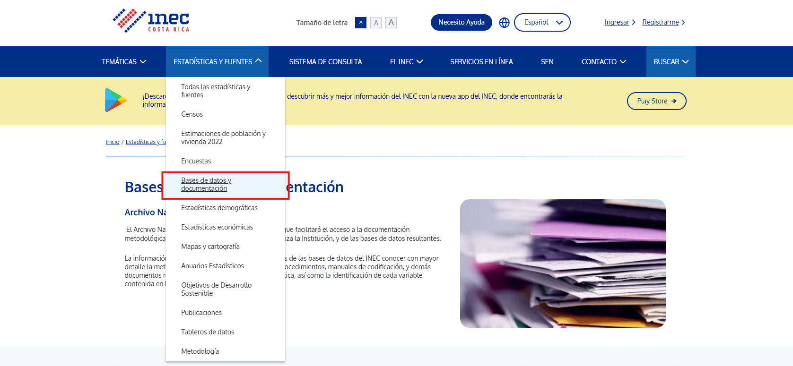
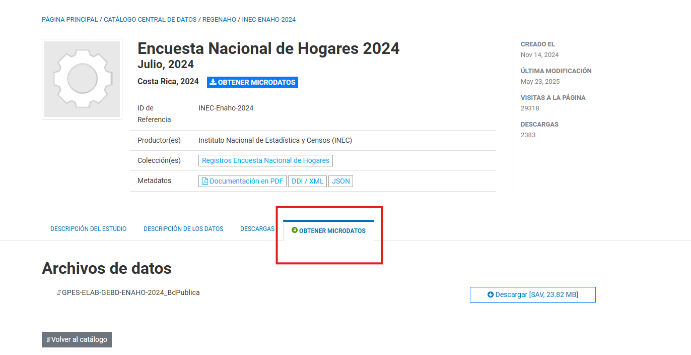

## Acceder Datos del INEC

En los laboratorios anteriores se han usado diferentes bases de datos, que en su mayoría pertenecen a las bases de datos que publica el INEC.

!!! info "INEC"
    El INEC es el Instituto Nacional de Estadística y Censos, y son quienes realizan las encuestas que se usan para analizar la situación socioeconómica del país, como por ejemplo el desempleo, la informalidad, la pobreza, entre otros.

Para descargar los microdatos que se obtienen en las encuestas podemos dirigrnos a la página [https://inec.cr/](https://inec.cr/)



Seleccionamos "Estadísticas y Fuentes" y luego "Bases de datos y documentación"

Aquí se encuentran diferentes las diferentes encuestas nacionales, por ejemplo la Encuesta Nacional de Hogares, la Encuesta Continua de Empleo y muchas más.

En nuestro caso vamos a descargar la Encuesta Nacional de Hogares de 2024



Seleccionamos la opción obtener microdatos y descargamos la base de datos.

<br>

---

## Análisis

Una vez descargamos la base de datos podemos empezar el análisis

!!! warning "Cargar la base de datos"
    Note que el formato del archivo es .sav, por lo que para cargar la base de datos usamos `import spss`

!!! info "Tip"
    Puede notar que la base de datos es grande y algunas variables tienen nombres complicados.

    Es fácil renombrar todas las variables en minúsculas o mayúsculas para evitar errores provocados por escribir mal algún nombre

Empezamos renombrando todas las variables a minúsculas

```stata
*Con el * le decimos a STATA que renombre todas las variables
*Con lower STATA entiende que debe dejar el mismo nombre pero en minúscula
rename *, lower()
```

<br>
En este laboratorio haremos un análisis separando a la población por grupos, por ejemplo, separando por ciudadanos nacionales y extranjeros.

Para esto usamos la variable `lugnac`, que indica el lugar de nacimiento de la persona.

Usando codebook podemos obtener un resumen de como funciona la variable

??? success "Resultado"
    ```stata
                      type:  numeric (byte)
                 label:  labels85

    range:  [0,4]                        units:  1
         unique values:  5                        missing .:  0/30,846

    tabulation:  Freq.   Numeric  Label
                        20,384         0  En mismo cantón de residencia
                         7,720         1  En otro cantón de residencia
                         2,167         2  En Nicaragua
                           164         3  En otro país centroamericano
                           411         4  En otro país del mundo
    ```

En este caso vemos que la variable toma 5 valores posibles, sin embargo, ya que solo nos interesa saber si la persona es nacional o extranjera, entonces podemos crear un indicador

```stata
recode lugnac (0/1=1) (2/4=0), gen(nacional)
*Creamos y aplicamos la etiqueta
label define nacional_lbl 0 "Extranjero" 1 "Nacional", replace
label values nacional nacional_lbl
*Tabulamos la variable
tab nacional
```

<br>

Queremos ver los años de experiencia de las personas, para esto le restamos los años de educación y los 6 años antes de primer grado a la edad de la persona

```stata
gen experiencia = a5 - escolari - 6
sum experiencia
```

??? failure "Resultado"
    ```stata

    Variable |        Obs        Mean    Std. Dev.       Min        Max
    -------------+---------------------------------------------------------
    experiencia |     30,846    24.36731    22.36055        -95         91

    ```

Note que el valor mínimo es de -95, pero eso significa que hay personas con ~90 años de escolaridad, lo cual no es posible

<br>

---

### scc install

!!! info "Instalar paquetes"
    A veces la comunidad elabora comandos que no se encuentran en la versión oficial de STATA

    Estos paquetes se pueden instalar usando`ssc install [paquete]`

Para nuestro caso es útil ver los valores únicos y las etiquetas, `codebook` solo muestra algunos valores, pero si queremos verlos todos debemos usar otro comando llamado `fre`

Primero instalamos el paquete y luego podemos usarlo como cualquier otro comando

```stata
*Instalarlo / Solo se tiene que hacer una vez
ssc install fre

*Luego se usa indicandole qué variable tabular
fre escolari
```

??? success "Resultado"

    ```stata

        escolari Años de escolaridad                                                                 
         
        Freq.    Percent      Valid       Cum.                                                           
        
        Valid   0  Sin escolaridad, preescolar o enseñanza                                              
        especial                                                                                         
        1  Un año                                                                                       
        2  Dos años                                                                                     
        3  Tres años                                                                                    
        4  Cuatro años                                                                                  
        5  Cinco años                                                                                   
        6  Seis años                                                                                    
        7  Siete años                                                                                   
        8  Ocho años                                                                                    
        9  Nueve años                                                                                   
        10 Diez años                                                                                    
        11 Once años                                                                                    
        12 Doce años                                                                                    
        13 Trece años                                                                                   
        14 Catorce años                                                                                 
        15 Quince años                                                                                  
        16 Dieciseis años                                                                               
        17 Diecisiete años                                                                              
        18 Dieciocho años                                                                               
        20 Veinte años                                                                                  
        21 Veintiuno años                                                                               
        22 Veintidós años                                                                              
        99 Ignorado                                                                                      
        Total                                                                                            
         
    ```                                                                                              

Note que no se debería tomar en cuenta el 99, ya que representa datos ignorados

```stata
*Eliminamos la variable
drop experiencia

*Generamos la variable de nuevo
gen experiencia = a5 - escolari - 6 if escolari!=99 & a5>6
*También excluimos a las personas menores de 6 años
```

<br>

---

### egen

A veces es útil también guardar las estadísticas que generamos como variables

La mayoría de los comandos que generan estadísticas no son compatibles con `gen`

```stata
*Si tratamos de guardar el promedio del ingreso bruto nos da error
gen sal_promedio = mean(spmb)
```

??? failure "Resultado"
    ``stata     "unknown function mean()"     ``

!!! info "egen"
    `egen` permite crear nuevas variables que contienen algún estadístico calculado, por ejemplo

    - [x] promedio
    - [x] varianza
    - [x] curtosis

```stata
*Esta forma si es correcta
egen sal_promedio = mean(spmb)
```

<br>

---

### group

Siguiendo con el análisis por grupos, a veces es interesante comparar más que solo 2 categorías, por ejemplo, además de personas migrantes y nacionales, comparar migrantes mujeres y nacionales mujeres

`group` nos permite hacer una variable que agrupa según las variables que le indicamos

```stata
*Agrupar por nacionalidad y sexo
egen nac_sexo = group(nacional a4)
label define nac_sexo_lbl 1 "H_ext" 2 "M_ext" 3 "H_nac" 4 "M_nac", replace
label values nac_sexo 
```

<br>

---

### bysort

`bysort` es útil para hacer operaciones entre grupos. La diferencia es que cuando usamos bysort, en lugar de aplicar la operación a toda la base de datos, va a dividir la base por grupo y luego va a ejecutar el comando que queremos.

```stata
*Tabular la rama de ocupación de mujeres costarricenses y extranjeras
bysort nac_sexo: tab ramaemppri if inlist(nac_sexo, 2,4), sort
```

También es posible crear variables

```stata
*Crear una variable que indique el total de personas en cada grupo
*_N indica el total de cada grupo
bysort nac_sexo: gen total_personas = _N
```

<br>

---

### table

`table` es muy similar a `tab`, pero este nos permite hacer tablas que combinen estadísticos de diferentes variables.

Su syntaxis es la siguiente

```stata
table variable_filas [opcional variable_columnas], contents(estadístico_1 variable_1 ...)
```

Por ejemplo, si nos interesa ver el salario promedio, la desviación estándar, los años de experiencia promedio y los años de educación promedio, según la nacionalidad y el sexo de la persona podemos hacerlo de la siguiente manera:

```stata
table nac_sexo if (escolari!=99) & (spmb>0), contents(mean spmb sd spmb mean escolari mean experiencia freq) format(%12.2fc)
```

??? success "Resultado"

    ```stata                                                                         
    | -------------------------------------------------------------------------------- |
    | group(nacional a4)                                                                        |
    | ----------+--------------------------------------------------------------------- |
    | H_ext                                                                            |
    | M_ext                                                                            |
    | H_nac                                                                            |
    | M_nac                                                                            |
    | -------------------------------------------------------------------------------- |
    ```                                                                              

<br>

---

### xtile

Si queremos hacer un análisis más detallado, por ejemplo identificar los años de escolaridad promedio dependiendo del quntil de ingreso de la persona

Podemos crea una variable que nos indique al quintil que pertenece la persona y luego una tabla que muestre los años de escolaridad

`xtile` nos permite crear una variable que indique el quintil

```stata
xtile nueva_var = var, nquantiles(#)
```

```stata
xtile quintil_ingreso =  spmb, nquantiles(5)
*Si solo queremos resumir una variable, se puede usar tab con la opción sum
tab quintil_ingreso if escolari!=99, sum(escolari)
```

??? success "Resultado"

    ```stata
    5 quantiles | Summary of Años de escolaridad of spmb
    ------------+-----------------------------------------
            1 | Mean:  8   Std. Dev.: 3   Freq.: 2,018
            2 | Mean:  9   Std. Dev.: 3   Freq.: 1,936
            3 | Mean:  9   Std. Dev.: 3   Freq.: 1,973
            4 | Mean: 12   Std. Dev.: 4   Freq.: 1,943
            5 | Mean: 15   Std. Dev.: 3   Freq.: 1,968
    ------------+-----------------------------------------
        Total | Mean: 10   Std. Dev.: 4   Freq.: 9,838
    ```

Si se quiere ver el valor de los percentiles se puede usar la opción detail con `summarize`

```stata
sum spmb, detail
```

??? success "Resultado"
    ```stata

     Salario principal monetario bruto                             
     ------------------------------------------------------------- 
     Percentiles      Smallest                                     
     1%        30000           4000                                
     5%       100000           4000                                
     10%       180000           4500       Obs               9,866 
     25%       300000           5000       Sum of Wgt.       9,866 
     50%       400000                      Mean           553925.7
                            Largest       Std. Dev.       498383.2
     75%       606000        6000000
     90%      1092858        6000000       Variance       2.48e+11
     95%      1500000        6307560       Skewness       3.497803
     99%      2628150        7000000       Kurtosis       23.43865

    ```

<br>


<!--  
### cv2

`cv2` nos permite calcular el coeficiente de variación para alguna variable, el cual indica cuanto representa la desviación estándar relativo al promedio de la variable. Esto nos permite identificar la variabilidad.

```stata
cv2 spmb experiencia
```
-->

---

## Gráficos de cajas

Por último se tiene el gráfico de cajas, que nos indica la distribución en cuartiles de alguna variable

En este caso se realiza un gráfico de cajas para analizar la variable salario neto

```stata title="Grafico de cajas y bigotes"
graph box spmb
```
En principio el gráfico se ve mal, ya que hay valores muy altos de salario que afectan la escala, si fuera posible excluir estos valores entonces se puede usar la opción `nooutsides`

```stata title="Grafico de cajas y bigotes"
graph box spmb, nooutsides
```

De igual manera se puede dividir el análisis por grupos. Se puede por ejemplo comparar la distribución del salario de las personas según si tienen o no título de bachillerato

```stata title="Ejemplo"
graph box spmb, over(nac_sexo) nooutsides
```