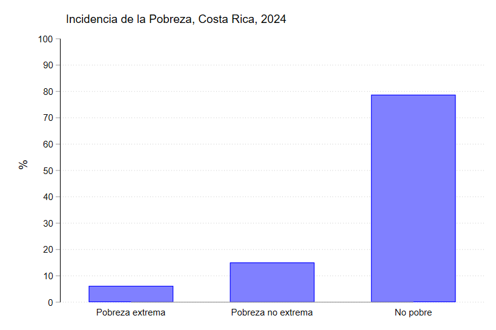
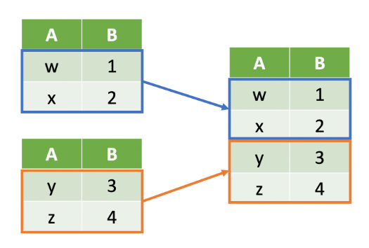
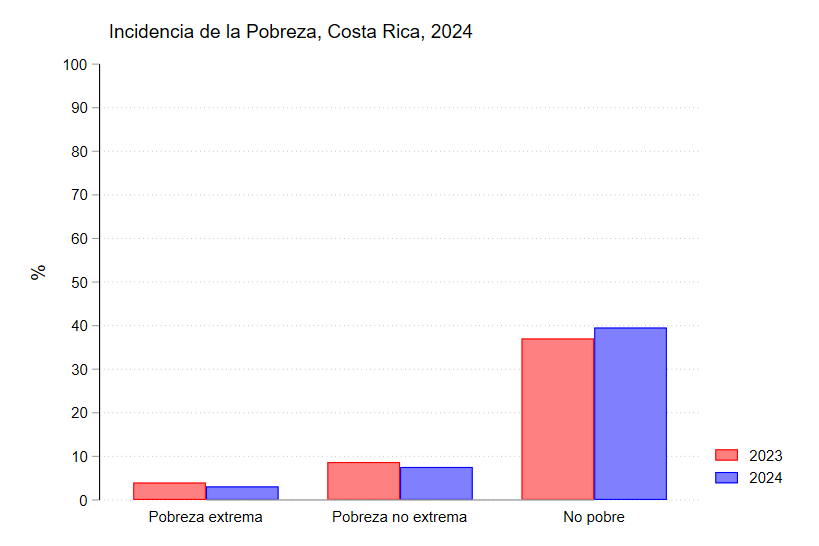
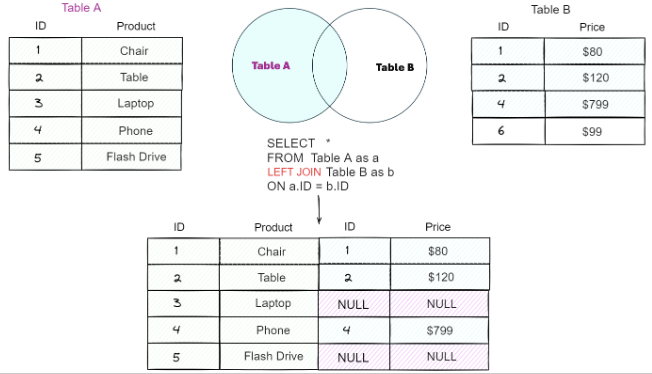
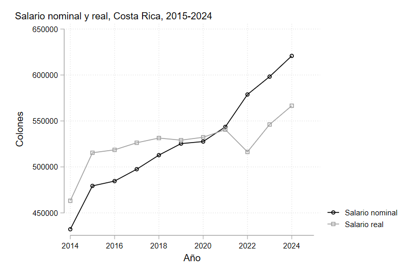

# Manejo de Bases de Datos

A veces al trabajar con bases de datos ocurre que necesitamos combinar los datos de 2 o más bases.

Piense por ejemplo en cómo se puede evaluar el nivel de pobreza del país.

Se tiene claro que podemos recurrir a los datos de la ENAHO para estudiar los indicadores de pobreza; sin embargo, hay un tema importante. ¿Cómo se sabe si el país está mejorando o empeorando en cuanto a la reducción de la pobreza?

??? success "Gráfico"
    

El gráfico anterior no nos dice mucho acerca de la situación del país si no somos capaces de contrastarlo con datos de años anteriores.

Dado que la ENAHO del 2024 solo tiene datos del año 2024, si queremos compararlo con otros años debemos de agregar los datos de la ENAHO 2023 por ejemplo.

<br>

---
### Append

`Append` nos permite pegar bases de datos de manera vertical.




Note en la imagen, que tenemos 2 bases de datos diferentes, una naranja y otra azul.

Al usar append, lo que hacemos es unirlas poniendo una bajo otra, para que así queden los datos en una única base.

!!! warning "Cuidado"
    Note que las variables de las 2 bases de datos son las mismas (A y B). Si trataramos de unir bases de datos con variables diferentes, solo se van a unir aquellas que estén en ambas bases de datos. El resto quedarán como observaciones perdidas (.)

```stata title="Syntaxis"
append using "base de datos"
```

!!! info "Tip"
    También es posible crear una nueva variable que sirva como identificador sobre cuáles observaciones eran de la base original y cuales observaciones son de la base que se añadió

```stata title="Ejemplo"
append using "enaho_2023.dta", gen(anno)
```

Por defecto a la variable anno se le añaden valores de 0 para las observaciones originales y 1 para las que fueron añadidas. Pero podemos ajustarla para que coincida con los años.

```stata
recode anno (0=2024) (1=2023)
```

Ahora si podemos visualizar la variación de un año a otro.

```stata title="Gráfico"
graph bar (percent), asyvars over(anno) over(np) ylabel(0(10)100) ///
ytitle("%") title("Incidencia de la Pobreza, Costa Rica, 2024", place("left")) ///
bar(1, color(red)) bar(2, color(blue))
```
??? Success "Gráfico" 
    

<br>

---
### Merge

A veces también es conveniente añadir datos que corresponden a una base de datos diferente. Por ejemplo, piense que nos interesa ver el crecimiento del salario promedio de las personas.

Podríamos simplemente calcular el salario promedio por año. Sin embargo, aún cuando los salarios crecen, también suele haber inflación, por lo que el poder adquisitivo de las personas puede no aumentar.

Para esto podemos ajustar el salario con el índice de precios, pero esta variable está en una base de datos diferente, ya que la publica el Banco Central.

[Puede descargar los datos del IPC dando click al enlace](https://sdd.bccr.fi.cr/es/IndicadoresEconomicos/Inicio/Contenedor/969?Cuadro=51)

Una vez que descarga la base, nuestro objetivo es añadir el valor del IPC del año correspondiente.

`merge` nos permite unir dos bases de datos que tienen una columna en común.



```stata title="Syntaxis"
merge 1:1 variable_en_común using "base_de_datos_a_unir"
*merge m:1 ...
*merge 1:m ...
*merge m:m ...
```

El segmento 1:1 le indica a STATA que cada identificador tiene una única observación.

En nuestro caso la base de datos de la ENAHO tiene múltiples observaciones para un mismo año, por lo que no podemos usar 1:1.

Debemos decirle a STATA que la base de datos 1 tiene múltiples observaciones para cada año. Esto lo hacemos poniendo una m de many.


```stata title="Ejemplo"
merge m:1 anno using ipc.dta
```

<br>

---
### Collapse

Finalmente se quiere realizar algún tipo de estadística que nos permita resumir y visualizar los datos.

En nuestro caso, ya que estamos trabajando con salarios reales y nominales, podemos realizar un gráfico de líneas que compare la evolución de los salarios en el tiempo.

`collapse` nos resumir los datos que tenemos en la base de acuerdo a las características de interés.

```stata title="Syntaxis"
collapse (estadistico) variable (estadistico_2) variable_2, by(variable_agrupar) 
```

Por ejemplo, si queremos resumir los ingresos salariales brutos según su promedio anual, utilizamos el siguiente código.

```stata title="Ejemplo"
collapse (mean) ipsbt ipsbt_real, by(anno) 
```

```stata title="Gráfico"
graph twoway connected ipsbt ipsbt_real anno, xlabel(2014(2)2025) ///
legend(label(1 "Salario nominal") label(2 "Salario real")) ///
xtitle("Año") ytitle("Colones") ///
title("Salario nominal y real, Costa Rica, 2015-2024", place("left") span)
```

??? success "Gráfico"
    