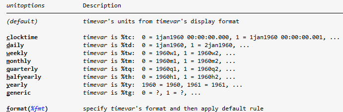

# Series de tiempo - I


[Descargar do-file con solución](https://drive.google.com/uc?export=download&id=1rOQwmsQpRgGfPyxCUqR9BOwM2ySp5IPN)

[Descargar base de datos](https://docs.google.com/uc?export=download&id=1T_8EU1q8gj6UKfyiupdDIZRNT8mdYsu2)

---
## Datos del Banco Central

En este laboratorio vamos a trabajar con una base de datos del Banco Central de Costa Rica.

Para descargar la base:

1. Ingrese a la página del [Banco Central de Costa Rica](https://www.bccr.fi.cr/SitePages/Inicio.aspx)
2. Seleccione el menú de **Indicadores Económicos**
3. Seleccione **Producción y empleo**
4. Busque la base **Producto interno bruto por actividad económica, volumen a precios del año anterior encadenado**
5. Exporte la base a Excel

!!! warning "Formato de la base"
    Antes de importar la base en Stata es necesario hacer algunos cambios de formato.

    En particular, copie los datos del PIB y péguelos transpuestos en una nueva hoja de Excel. De esta forma, cada fila representa un año y cada columna representa una variable.

Una vez que la base esté lista, podemos importarla en Stata.

```stata title="Importar base desde Excel"
import excel using "ruta del archivo.xlsx", sheet("Hoja2") firstrow clear
```

!!! tip "Nombres de variables"
    Al importar datos desde Excel, Stata puede modificar nombres de variables que tienen tildes, espacios o caracteres especiales.

    Use `describe` para revisar cómo quedaron llamados los campos antes de continuar.

```stata title="Revisar variables"
describe
```

En este ejemplo vamos a trabajar con el Producto Interno Bruto. Para que el código sea más sencillo, podemos renombrar la variable y expresar los valores en millones.

```stata title="Preparar variable del PIB"
rename ProductoInternoBrutoapr PIB
label var PIB "Producto Interno Bruto"
replace PIB = PIB/1000000
```

<br>

---
## ¿Qué es una serie de tiempo?

Una serie de tiempo es un conjunto de datos registrados a lo largo del tiempo, generalmente en intervalos regulares como días, meses, trimestres o años.

Muchos datos económicos son registrados como series de tiempo. Por ejemplo:

- Producto Interno Bruto
- Inflación
- Tipo de cambio
- Desempleo
- Tasas de interés

!!! info "Series de tiempo"
    En economía, las series de tiempo son útiles porque permiten analizar cómo cambia una variable, identificar patrones y comparar periodos.

    Más adelante en la carrera verán técnicas más avanzadas para proyectar y modelar este tipo de datos.

<br>

---
## Conceptos útiles

Antes de trabajar con los comandos, conviene tener claros algunos conceptos:

!!! note "Tendencia"
    La tendencia es el comportamiento de la serie en el largo plazo.

!!! note "Ciclo"
    El ciclo es el movimiento de la serie alrededor de su tendencia durante un cierto periodo de tiempo.

!!! note "Estacionalidad"
    La estacionalidad corresponde a patrones que se repiten en momentos específicos del periodo de observación.

    Por ejemplo, dado que el consumo generalmente aumenta en diciembre, este aumento se considera un componente estacional.

<!-- !!! note "Estacionariedad"
    Una serie es estacionaria cuando sus parámetros estadísticos se mantienen relativamente constantes en el tiempo. -->

!!! note "Componente aleatorio"
    Es la parte irregular e impredecible de la serie.

<br>

---
## Declarar una serie de tiempo

Para trabajar formalmente con series de tiempo en Stata usamos el comando `tsset`.

```stata title="Sintaxis general"
tsset variable_tiempo, unitoptions delta(#)
```

Donde:

- `variable_tiempo` indica el momento en el que se registra cada observación
- `unitoptions` indica la unidad de tiempo si la variable no tiene formato temporal
- `delta(#)` indica cada cuántos periodos aparece una observación

!!! danger "Importante"
    Antes de usar comandos como `tsline`, rezagos `L.` o diferencias `D.`, Stata necesita saber cuál variable ordena el tiempo.

### Crear una variable de tiempo

Algunas bases ya tienen una variable de tiempo. Si no existe, se puede crear.

Por ejemplo, si la primera observación corresponde a 1978 y los datos son anuales:

```stata title="Serie anual"
gen anno = 1978 + _n - 1
*_n es un contador que le va sumando 1 a las filas, 
*es decir para la primera fila _n=1, para la segunda _n=2, ...
format anno %ty
tsset anno
```

!!! danger "Formato de Fecha"
    Con `format` le indicamos el formato de la fecha, tenga en cuenta que los datos pueden ser mensuales, semanales, etc...

    A continuación se muestran los diferentes posibles formatos y la forma en la que se utilizan. Puede ver mas información usando `help tsset`



A continuación se muestran ejemplos de cómo usar otros formatos de intervalo de tiempo.

Si la primera observación corresponde a junio de 2006 y los datos son mensuales:

```stata title="Serie mensual"
gen mes = tm(2006m6) + _n - 1
format mes %tm
tsset mes
```

!!! danger "tm"
    `tm` le indica a Stata que los datos son mensuales, "Time Monthly", note que la dentro del paréntesis debemos poner la fecha como se muestra en la imagen con los formatos de fecha


Si la primera observación corresponde al primer trimestre de 2022:

```stata title="Serie trimestral"
gen trimestre = tq(2022q1) + _n - 1
format trimestre %tq
tsset trimestre
```


### Declarar la serie del PIB

En la base del Banco Central ya existe una variable que identifica la fecha. Sin embargo, no está en el formato de Stata por lo que es mejor crear una nueva variable que indique el año.

```stata title="Crear variable de año"
gen anno = 1991 + _n - 1
```

### Formas de declarar una variable de tiempo
```stata title="Forma 1 - Luego de la coma usando tsset"
tsset anno, yearly
```

También se puede aplicar el formato anual y luego declarar la serie:
```stata title="Forma 2 - Primero formato y luego declarar la serie"
format anno %ty 
tsset anno
```


!!! warning "delta"
    **Note que no usamos la opción `delta`**

    Si no tuvieramos los datos para todos los años, sino por ejemplo cada 5 años entonces deberíamos usar `delta(5)`.

    Ejemplo:
    ```stata
    format anno %ty 
    tsset anno, delta(5)
    ```

<br>

---
## Graficar series de tiempo

Cuando declaramos la base como serie de tiempo podemos usar muchas funcionalidades adicionales para series de tiempo. Estos comandos empiezan con ts de time series.

Por ejemplo, una de las razones por las cuales podemos querer declarar una
serie de tiempo es para hacer gráficos `tsline`.

```stata title="Graficar PIB"
tsline PIB
```

`tsline` pertenece a la familia de gráficos `twoway`, por lo que se pueden usar opciones similares a las vistas en laboratorios anteriores.

```stata title="Graficar PIB con formato"
tsline PIB, ///
title("Producto Interno Bruto") ///
ytitle("PIB en millones") ///
xtitle("Año") ///
scheme(plotplain)
```

<br>

---
## Promedio móvil

Los promedios móviles son una herramienta básica para suavizar una serie de tiempo y observar mejor su tendencia.

En lugar de usar solamente el valor observado en un periodo, el promedio móvil calcula una media usando observaciones cercanas.

!!! info "Promedio móvil"
    Suavizar una serie ayuda a reducir fluctuaciones de corto plazo y facilita ver la **tendencia** de largo plazo de los datos. 


La sintaxis general en Stata para calcular un promedio móvil es la siguiente:

```stata title="Sintaxis"
tssmooth ma nueva_variable = variable_original, window(#l #c #f)
```

Donde:

- `#l` indica cuántos periodos hacia atrás se incluyen
- `#c` indica si se incluye la observación actual (1 si se quiere incluir, 0 si se quiere excluir)
- `#f` indica cuántos periodos hacia adelante se incluyen

Por ejemplo, podemos calcular un promedio móvil de cinco periodos para el PIB:

```stata title="Promedio móvil simple"
tssmooth ma media_movil = PIB, window(2,1,2)
order media_movil, after(PIB)
label var media_movil "Promedio móvil del PIB"
```

Luego podemos comparar la serie original con la serie suavizada.

```stata title="PIB y promedio móvil"
tsline PIB media_movil
```

<br>

---
## Promedio móvil ponderado

También podemos calcular un promedio móvil ponderado. En este caso, las observaciones no reciben el mismo peso.

Generalmente se da mayor peso a las observaciones más cercanas al periodo actual y menor peso a las observaciones más lejanas.

```stata title="Sintaxis"
tssmooth ma nueva_variable = variable_original, weights(numlistl <#c> numlistf)
```

Donde:

- `numlistl` indica los pesos de las observaciones previas
- `#c` indica el peso de la observación actual
- `numlistf` indica los pesos de las observaciones posteriores

```stata title="Promedio móvil ponderado"
tssmooth ma media_movil_pesos = PIB, weights(1/2 <4> 2/1)
order media_movil_pesos, after(PIB)
label var media_movil_pesos "Promedio móvil ponderado del PIB"
```

```stata title="Comparar series"
tsline PIB media_movil media_movil_pesos
```

!!! note "Interpretación de los pesos"
    En `weights(1/2 <4> 2/1)`, Stata asigna:

    - peso 1 a la observación `t-2`
    - peso 2 a la observación `t-1`
    - peso 4 a la observación actual `t`
    - peso 2 a la observación `t+1`
    - peso 1 a la observación `t+2`

<br>

---
## Rezagos y diferencias

En análisis de series de tiempo es común crear variables derivadas de una misma serie.

!!! info "Rezagos"
    Un rezago es el valor que tenía una variable en un periodo anterior.

    En Stata se usa `L.variable`.

!!! info "Diferencias"
    Una diferencia es el cambio absoluto entre el valor actual y el valor del periodo anterior.

    En Stata se usa `D.variable`.

!!! warning "Missing values"
    Al crear rezagos y diferencias se generan valores perdidos al inicio de la serie, porque no existen periodos anteriores para las primeras observaciones.

Por ejemplo, podemos crear una variable con el PIB rezagado cinco periodos.

```stata title="Rezago de cinco periodos"
gen PIB_rezagos = L2.PIB
order PIB_rezagos, after(PIB)
```

También podemos calcular la tasa de crecimiento del PIB:

```stata title="Crecimiento del PIB"
gen crecimiento = D.PIB/L.PIB*100
order crecimiento, after(PIB_rezagos)
```

La expresión anterior calcula:

$$
\frac{PIB_t - PIB_{t-1}}{PIB_{t-1}} \times 100
$$

Finalmente, podemos graficar la tasa de crecimiento.

```stata title="Graficar crecimiento"
tsline crecimiento
```

<br>

---
## Ejercicio

Usando la base del PIB trimestral -> [descargar base](https://docs.google.com/uc?export=download&id=1yFT_tjhgwz9kS4EIHLCxpz1yCVM8mtwc)


1. Declare la base como serie de tiempo **ponga atención al formato de tiempo**.
2. Grafique la serie del PIB.
3. Calcule un promedio móvil simple de cinco periodos.
4. Calcule un promedio móvil ponderado con 4 periodos.
5. Calcule la tasa de crecimiento del PIB.
6. Grafique la tasa de crecimiento e interprete los periodos con aumentos y caídas.

