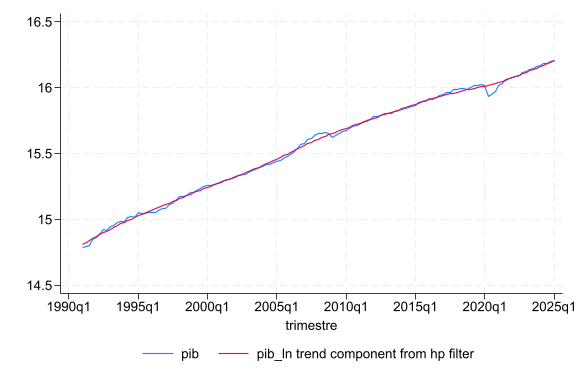
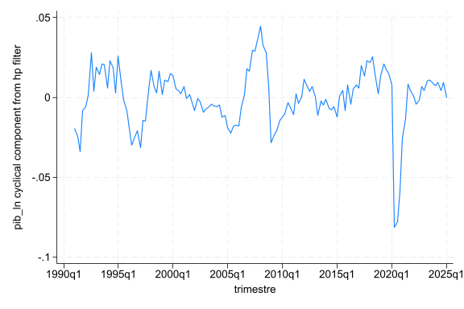
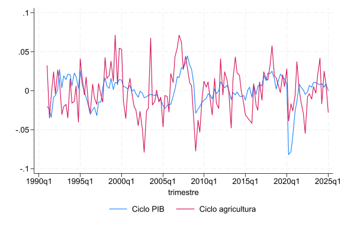
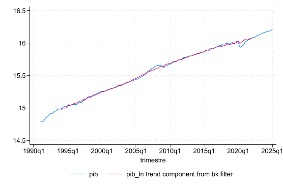
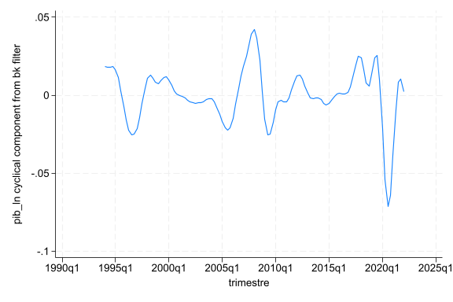
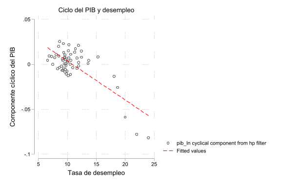

# Series de tiempo - II

En el laboratorio anterior vimos cómo declarar una serie de tiempo con `tsset`, graficarla con `tsline` y suavizarla usando promedios móviles. En este laboratorio vamos a ver dos formas adicionales -y más formales- de separar una serie en **tendencia** y **ciclo**: el filtro de Hodrick-Prescott y el filtro de Baxter-King. Además, vamos a ver cómo calcular y graficar la correlación entre dos series.

<a href="dofiles/dofile_semana15.do" download>Puede descargar el dofile aquí</a>

---
## Filtro Hodrick-Prescott

En el laboratorio pasado vimos que una forma de estimar la tendencia de una serie es mediante promedios móviles (simples o ponderados).

!!! info "Filtro Hodrick-Prescott"
    El filtro de Hodrick-Prescott (HP) es otra forma de descomponer una serie de tiempo, en este caso en dos componentes:

    - **Tendencia**: el comportamiento de largo plazo de la serie
    - **Componente cíclico**: las fluctuaciones de la serie alrededor de su tendencia

    Es un método muy utilizado en macroeconomía para identificar el ciclo económico, aunque también ha recibido críticas por la forma en la que calcula la tendencia.

### Sintaxis

```stata title="Sintaxis"
tsfilter hp nueva_variable = variable_original, smooth(#) trend(nueva_variable_2)
```

Donde:

| Argumento | Significado |
|:---:|:---|
| `nueva_variable` | Nombre con el que se guarda el **componente cíclico** |
| `variable_original` | Variable a la que se le aplica el filtro |
| `smooth(#)` | Parámetro de suavizado del filtro |
| `trend(nueva_variable_2)` | Nombre con el que se guarda la **tendencia** |

!!! tip "¿Qué valor usar en smooth()?"
    El parámetro `smooth()` depende de la frecuencia de los datos. Algunos valores usados comúnmente en la literatura son:

    - Datos anuales: 100
    - Datos trimestrales: 1600
    - Datos mensuales: 14400

    En nuestro caso, como vamos a trabajar con datos trimestrales, usamos `smooth(1600)`.

!!! danger "Importante"
    Al igual que con los comandos vistos en el laboratorio anterior (`tsline`, `L.`, `D.`), es necesario declarar la serie de tiempo con `tsset` antes de poder usar `tsfilter`.

<br>

---
## Ejemplo - PIB trimestral

Vamos a aplicar el filtro de Hodrick-Prescott a la serie del PIB trimestral de Costa Rica que trabajamos en el laboratorio anterior.

```stata title="Cargar la base de datos"
cd "ruta donde se encuentra la base"
use desestacionalizado.dta, clear
```

!!! warning "Serie desestacionalizada"
    Note que la base se llama `desestacionalizado.dta`. Esto es porque los filtros de tendencia y ciclo asumen que ya se eliminó el componente estacional de la serie.

    Si aplicáramos el filtro directamente sobre una serie con estacionalidad (por ejemplo `pib_real.dta`), el componente estacional se mezclaría con el componente cíclico y la descomposición ya no sería tan clara.

Como la variable de tiempo que trae la base no quedó en el formato correcto, la volvemos a generar y declaramos la serie:

```stata title="Declarar la serie de tiempo"
drop trimestre
gen trimestre = tq(1991q1) + _n - 1
tsset trimestre, quarterly
```

Ahora sí podemos aplicar el filtro sobre la variable `pib`:

```stata title="Aplicar el filtro Hodrick-Prescott"
tsfilter hp ciclos_pib_hp = pib, smooth(1600) trend(tendencia_pib_hp)
```

Esto crea dos variables nuevas:

- `tendencia_pib_hp`: la tendencia de largo plazo del PIB
- `ciclos_pib_hp`: el componente cíclico del PIB

Podemos graficar la serie original junto con su tendencia:

```stata title="PIB y tendencia"
tsline pib tendencia_pib_hp
```



Y por separado podemos observar el componente cíclico:

```stata title="Componente cíclico"
tsline ciclos_pib_hp
```



!!! note "Interpretación"
    Cuando el componente cíclico es positivo, el PIB está por encima de su tendencia de largo plazo (la economía está en auge). Cuando es negativo, el PIB está por debajo de su tendencia (la economía está en un periodo de desaceleración).

<br>

---
## Comparar el ciclo entre sectores

Una de las ventajas de obtener el componente cíclico es que podemos comparar qué tan sensible es un sector económico específico al ciclo del PIB total.

Por ejemplo, podemos aplicar el mismo filtro a la variable `agricultura` y comparar su ciclo con el del PIB:

```stata title="Filtro para el sector agrícola"
tsfilter hp ciclos_agr_hp = agricultura, smooth(1600) trend(agricultura_trend)
```

```stata title="Comparar ciclos"
tsline ciclos_pib_hp ciclos_agr_hp
```



!!! note "Interpretación"
    Si el ciclo de un sector se mueve de forma muy parecida al ciclo del PIB, decimos que es un sector **procíclico**. Si se mueve en sentido contrario, decimos que es **contracíclico**. Si casi no se relaciona con el ciclo del PIB, decimos que es **acíclico**.

<br>

---
## Filtro Baxter-King

!!! info "Filtro Baxter-King"
    El filtro de Baxter-King (BK) es una alternativa al filtro de Hodrick-Prescott para obtener el componente cíclico de una serie. A diferencia del filtro HP, el filtro BK es un filtro de **paso de banda**: elimina tanto las fluctuaciones de muy corto plazo (ruido) como las de muy largo plazo (tendencia), dejando únicamente las fluctuaciones asociadas al ciclo económico.

### Sintaxis

```stata title="Sintaxis"
tsfilter bk nueva_variable = variable_original, trend(nueva_variable_2)
```

Note que la sintaxis es muy similar a la del filtro HP, solo que el filtro BK no necesita la opción `smooth()`.

Aplicándolo a nuestra serie del PIB:

```stata title="Aplicar el filtro Baxter-King"
tsfilter bk ciclos_pib_bk = pib, trend(tendencia_pib_bk)
```

```stata title="PIB y tendencia"
tsline pib tendencia_pib_bk
```



```stata title="Componente cíclico"
tsline ciclos_pib_bk
```



!!! tip "HP vs BK"
    Ambos filtros buscan lo mismo (separar tendencia y ciclo), pero lo hacen de forma distinta, por lo que es normal que el componente cíclico no sea idéntico entre ambos métodos. Puede comparar `ciclos_pib_hp` y `ciclos_pib_bk` con `tsline` para ver las diferencias.

<br>

---
## Correlación

Otra pregunta común en el análisis de series de tiempo es si dos variables se mueven juntas. Por ejemplo, ¿el ciclo económico está relacionado con el desempleo?

Para esto usamos el **coeficiente de correlación de Pearson**, el cual nos indica el grado de asociación lineal entre dos variables, con valores entre -1 y 1.

!!! info "Interpretación del coeficiente"
    - Cercano a 1: asociación lineal positiva fuerte
    - Cercano a -1: asociación lineal negativa fuerte
    - Cercano a 0: poca o ninguna asociación lineal

En Stata existen dos comandos para calcular este coeficiente:

```stata title="Sintaxis"
correlate listado_variables
```

```stata
             |   pib_ln ciclos~o
-------------+------------------
      pib_ln |   1.0000
ciclos_des~o |  -0.1607   1.0000
```

### Ejemplo

Podemos ver si existe relación entre el componente cíclico del PIB y la tasa de desempleo:

```stata title="Calcular correlación"
correlate ciclos_pib_hp desempleo
```

!!! success "Resultado esperado"
    Se espera obtener un coeficiente **negativo**, ya que cuando la economía crece por encima de su tendencia (ciclo positivo) generalmente el desempleo tiende a disminuir, y viceversa.

<br>

---
## Graficar correlaciones

Una forma muy común de ilustrar una correlación es con un gráfico de dispersión (`scatter`). Para complementarlo, podemos agregar una línea de mejor ajuste usando `lfit` dentro de un gráfico `twoway`.

```stata title="Sintaxis"
twoway (scatter variable_y variable_x) (lfit variable_y variable_x)
```

### Ejemplo

```stata title="Dispersión con línea de ajuste"
graph twoway (scatter ciclos_pib_hp desempleo) ///
(lfit ciclos_pib_hp desempleo, color(red)), ///
scheme(plotplain) ///
title("Ciclo del PIB y desempleo") ///
ytitle("Componente cíclico del PIB") ///
xtitle("Tasa de desempleo")
```



La línea roja (`lfit`) nos muestra la pendiente de la relación lineal entre ambas variables, lo que facilita observar visualmente si la relación es positiva, negativa o prácticamente plana.

<br>

---
## Resumen de comandos

| **Comando** | **Función** |
|:---:|:---|
| `tsfilter hp` | Descompone una serie en tendencia y ciclo (filtro Hodrick-Prescott) |
| `tsfilter bk` | Descompone una serie en tendencia y ciclo (filtro Baxter-King) |
| `correlate` | Calcula correlación de Pearson (excluye observación si falta algún dato) |
| `twoway (scatter...) (lfit...)` | Gráfico de dispersión con línea de mejor ajuste |

<br>

---
## Ejercicio

Usando la base de datos del PIB trimestral:

1. Aplique el filtro de Hodrick-Prescott a la variable de desempleo y obtenga su componente cíclico.
2. Calcule la correlación entre el componente cíclico del desempleo y el componente cíclico del PIB (`ciclos_pib_hp`).
3. Grafique la relación entre ambas variables usando `scatter` y `lfit`.
4. Compare el componente cíclico del PIB con el del sector construcción ¿Qué tipo de relación existe, acíclica, contra-cíclica o pro-cíclica?