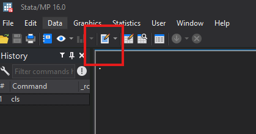
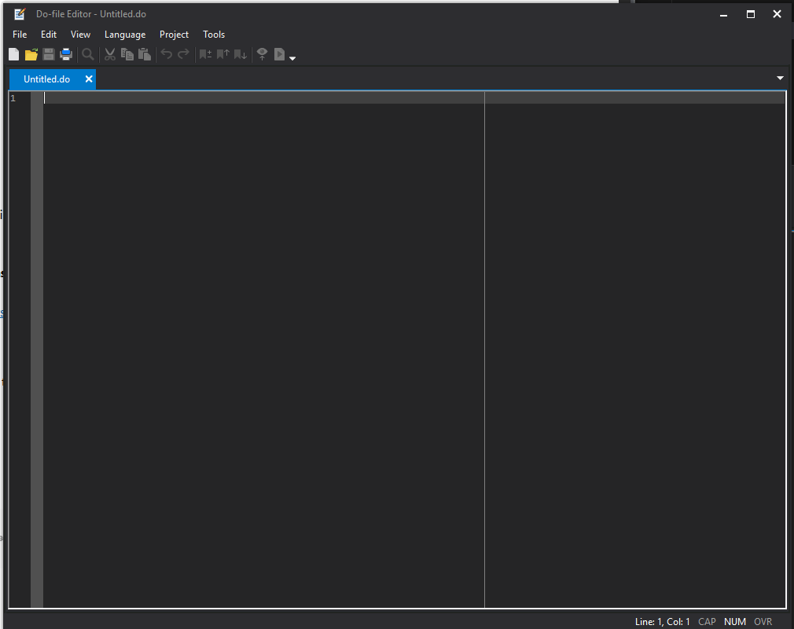
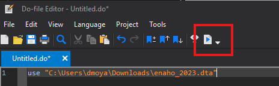
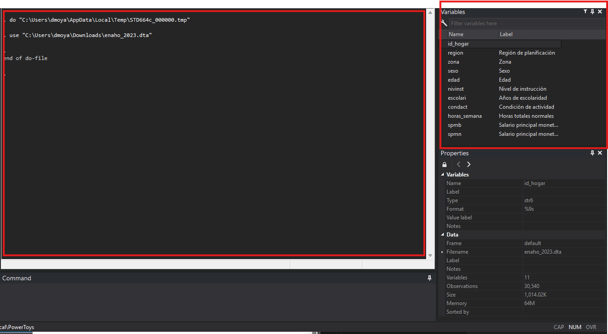
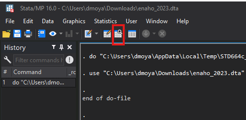
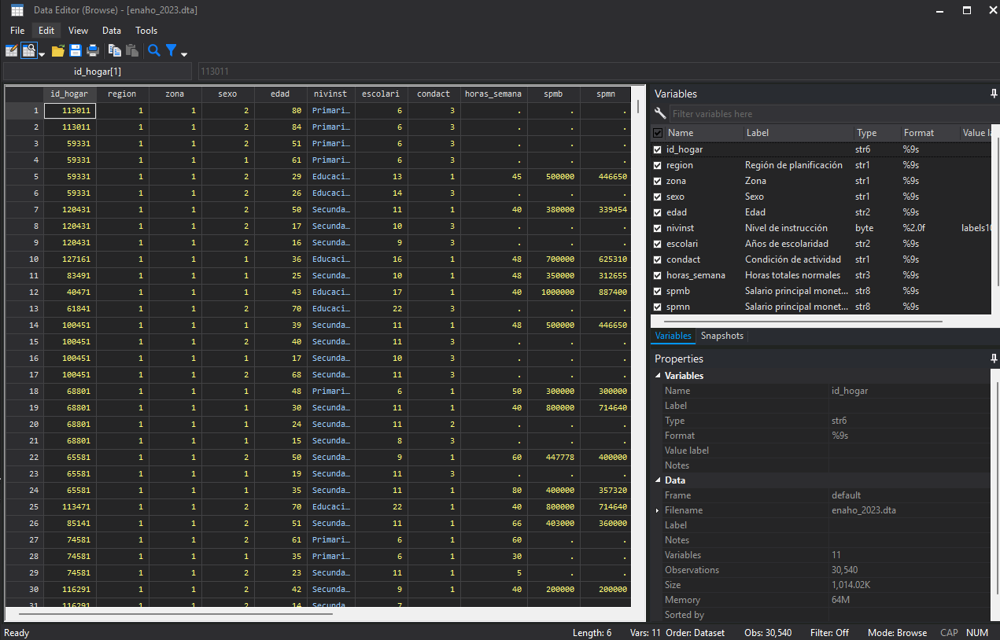
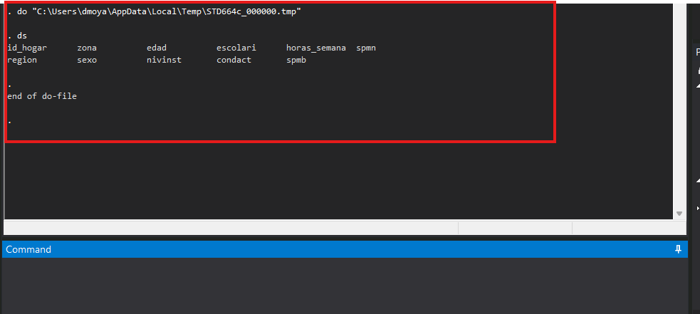
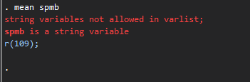
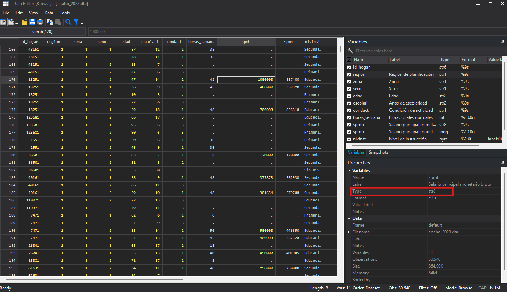

# Interfaz de STATA e importación de bases de datos

Para empezar a trabajar con una base de datos lo primero es abrir un archivo de tipo do, donde vamos a escribir los comandos para que decirle a STATA lo que queremos que haga.



Esto va a abrir un cuaderno que se vería así.



Una vez abierto el dofile podemos empezar a trabajar con `STATA`

---

## Comandos

### use 

El primer comando que veremos es `use` el cual nos sirve para cargar archivos de formato `STATA` 

```stata title="syntaxis"
use "ruta de acceso al archivo en mi computadora"
```

Por ejemplo

```stata
use "C:\Users\dmoya\Downloads\enaho_2023.dta"
```

Una vez que escribe esto en el dofile puede correr el comando usando `ctrl+D` o dando click en el siguiente ícono 


!!! warning "Posibles errores"
    - Verifique que la ruta sea correcta (puede copiarla seleccionando el archivo y usando `ctrl+shift+c`)
    - Si intenta volver a correr el comando posiblemente tenga un error (explicación más adelante)

Luego de ejecutar un comando, `STATA` nos indica el resultado en la consola que es la pantalla grande que se puede ver al inicio. Aquí nos muestra que ejeutó el comando  `use`.

Puede también verificar que cargó los datos revisando la pestaña de variables que se encuentra a la derecha


Seguro se puede estar preguntando ¿dónde veo los datos?

---
### browse

Para ver los datos podemos usar el comando `browse` o podemos dar click en el explorador de variables

**Opción 1:**
```stata
*Escribir browse en el dofile y ejecutarlo
browse
```

**Opción 2:** 

De click en el siguiente ícono


En cualquiera de los dos casos se abrirá una pestaña adicional con los datos en formato de tabla


Aquí puede ver las diferentes variables con las que contamos, en nuestro caso estamos trabajando con la encuesta de hogares, por lo que cada fila representa una persona y sus características, por ejemplo: la región, la zona, el sexo, su nivel de instrucción, etc.

---
### ds

Si quisieramos simplemente ver las variables que tenemos disponibles podemos usar `ds`
```stata
*El resultado se muestra en la consola
ds
```



---
### order

A veces trabajamos con bases de datos muy grandes. Una encuesta de hogares puede tener hasta más de **500** columnas. ¿Qué pasaría por ejemplo, si variable de interés está en la columna 400?

Para estos casos es útil saber como reordenar la base de datos para que las columnas que nos interesan sean fáciles de ver.

Usando `order` podemos indicarle a `STATA` qué columnas queremos que nos muestre al inicio

```stata title="syntaxis"
order variable1 variable2 ...
```
En nuestro caso, si quisieramos colocar el nivel de instrucción al inicio se vería así
```stata
order nivinst
```

---

### opciones

!!! info "Opciones"
    También es posible agregar `opciones` a los comandos con la finalidad de indicar cosas adicionales

Por ejemplo, si queremos ordenar la columna, detrás de alguna otra podemos indicarlo.

En general para poner añadir opciones a cualquier comando se sigue la siguiente syntaxis

```stata title="opciones"
comando <argumentos>, opciones

*Ejemplo

order nivinst, after(region)

```

!!! Danger "Cuidado"
    Es importante añadir los paréntesis después de after, ya que `STATA` separa las opciones por espacios.

    Entonces con los paréntesis le decimos a `STATA` el argumento a usar para la opción after

    Si solo escribimos 
    ```stata
    order nivinst, after region
    ```

    `STATA` piensa que region es otra opción y nos dará error

En general se escribe así
```stata
comando  <argumentos>, opcion1(argumento) opcion2(argumento) ...
```

También podemos decirle que acomode la variable al final

```stata
order nivinst, last
```

--- 

## Tipos de variables

Un tema muy importante a tener en cuenta es que existen diferentes tipos de variables. Con esto nos referimos a la forma en la que STATA guarda los valores.

!!! question "Qué tipos existen"


|     Tipo    	|          Descripción         	|
|:-----------:	|:----------------------------:	|
| **_Texto_** 	|                              	|
|    `String`   	|      Texto o caracteres      	|
| **_Numéricas_** 	|                              	|
|     `byte`    	|      Entero muy pequeño      	|
|     `int`     	|        Entero mediano        	|
|     `long`    	|         Entero grande        	|
|    `float`    	| Decimal con precisión simple 	|
|    `double`   	|  Decimal con mayor precisión 	|

!!! warning "Problemas"
    Esto puede parecer poco importante, pero es necesario tenerlo en cuenta para evitar errores como este:

```stata
*Calcular promedio del salario
mean spmb
```


Cuando `STATA` nos muestra un texto rojo significa que no pudo ejecutar el comando debido a un error.

En este caso intentamos calcular el promedio del salario bruto de las personas, pero el obtenemos un error que dice spmb es una variable de tipo `string`. 

Es decir, a pesar de que podemos ver números en la columna `STATA` tiene la variable guardada como texto, por lo que no puede calcular el promedio.



Podemos observar el tipo de variable almacenado en `STATA` en la pestaña de propiedades abajo a la derecha y veremos que el tipo dice `str` o sea `string`

---

!!! info "Convertir variables"
    En estos casos es necesario convertir el tipo de variables

### destring

```stata title="syntaxis"
destring variable, replace
*replace remplaza la variable original

*Si no queremos remplazar la variable original 
destring variable, gen(nombre_variable_nueva)
```

Ejemplo

```stata
destring spmb, replace
mean spmb

*Resultado
*Mean estimation                   Number of obs   =      9,562

--------------------------------------------------------------
             |       Mean   Std. Err.     [95% Conf. Interval]
-------------+------------------------------------------------
        spmb |   536077.6   5269.032      525749.2      546406
--------------------------------------------------------------

*Ya no obtenemos errores!
```

---

### gsort

Con gsort podemos ordenar la base de datos con respecto a alguna variable

Ejemplo

```stata
gsort spmb
```

---

## Resumen de comandos

| **Comando** 	|          **Función**          	|
|:-----------:	|:-----------------------------:	|
| `use`         	| Cargar la base de datos       	|
| `browse`      	| Abrir explorador de variables 	|
| `ds`          	| Listar variables              	|
| `order`       	| Acomodar columnas             	|
| `destring`    	| Convertir string a número     	|
| `gsort`       	| Ordenar la base de datos      	|

[Descargar do-file](https://www.dropbox.com/scl/fi/ffrmdpy8s07daqr8txikp/lab5.do?rlkey=4m09zaboqerq6fad4clbiivha&st=721eh8iv&dl=0)

[Descargar práctica](https://www.dropbox.com/scl/fi/53ntkhz7yzg8fc86snmso/practica.do?rlkey=gkg5c7r8o35npm0jz7oflnhcy&st=y6i21bxx&dl=0)

