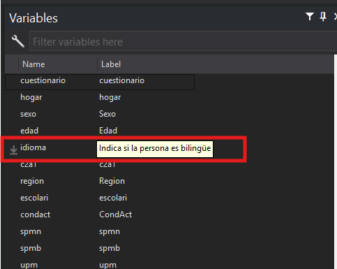

#Importar archivos y uso de etiquetas

[Descargar archivo de excel](https://docs.google.com/spreadsheets/d/1B6kI-b67q4y1GmED0XWXCtNYc6K0ug0p/export?format=xlsx)

## Comandos


---
### cd

!!! info "Directorio de trabajo"
    Cuando trabajamos con programas como STATA es importante tener en cuenta que existe algo llamado directorio de trabajo. Puede pensar en el directorio de trabajo como la carpeta en la que STATA busca y guarda archivos en la computadora.


Es importante tener esto en cuenta porque cuando guardemos archivos, por ejemplo un gráfico, STATA lo guarda en nuestro directorio de trabajo actual.

!!! info "cd"
    `cd` signficia change directory y nos permite cambiar la carpeta en la que estamos trabajando.

    `pwd` nos permite ver la carpeta que estamos usando 


```stata title="change directory"

*Primero podemos ver la carpeta inicial
pwd

*Luego podemos cambiarla usando cd
cd "C:\Users\dmoya\Downloads\lab5"

pwd


```
??? success "Resultado" 
    ```stata
    
    *Primera carpeta
    C:\Users\dmoya\AppData\Local\PowerToys

    *Luego de cambiarla
    C:\Users\dmoya\Downloads\lab5
    ```

<br>

---

### import excel

En la clase pasada vimos que se podían cargar archivos de STATA usando `use`

Podemos tratar de abrir la base de datos para este laboratorio

```stata
use "base_lab5.xlsx"
```

Pero esto nos da el siguiente error

??? failure "Resultado"
    ```stata
    
    "file base_lab5.xlsx not Stata format"
    ```

Esto ocurre porque el formato del archivo es de `xlsx` o sea formato Excel, pero `use` sirve para cargar solo archivos de STATA.

Para cargar archivos en otros formatos hay que usar el comando `import` y especificar el tipo de archivo.

```stata title="import excel"
import excel "base_lab5.xlsx", firstrow
```

La opción `firstrow` le indica a STATA que la primera fila del archivo tiene los nombres de las variables

<br>

---

### save

Otra utilidad que tenemos es que podemos guardar la base de datos en formato `STATA` o `.dta`. Para esto usamos `save`.

```stata title="save"
save base_lab5
```

Llegados a este punto podemos analizar la base de datos


<br>

---

### labels

Lo primero que podemos observar es la variable idioma. Esta indica si la persona habla o no otro idioma; sin embargo, tiene valores numéricos de 0 y 1, por lo que no es claro a qué se refiere cada uno.


!!! info "labels"
    En este caso sería muy útil indicar que 1 signfica "sí" y 0 significa "no". 
    
    Para esto nos sirven las etiquetas o `labels`

#### label define

Para crear una etiqueta usamos la siguiente syintaxis

```stata title="syntaxis"
label define nombre numero1 "valor1" numero2 "valor2" ...
```

```stata title="Ejemplo"
label define label_idioma 0 "No" 1 "Sí"
```

!!! tip
    Puede pensar en las etiquetas como un diccionario que me dice la definición de lo que significa cada número.

Luego de ejectuar el comando puede revisar la base de datos, pero verá que aún tenemos solo los valores 0 y 1.

!!! warning "aplicar etiquetas"
    `label define` solo define una etiqueta, pero en ningún momento la aplicamos a alguna variable.

#### label values

Para aplicar una etiqueta se usa `label values` 

```stata title="label values"
label values nombre_variable nombre_etiqueta
```

```stata title="Ejemplo"
label values idioma label_idioma
*Ahora sí aplicó las etiquetas
```

<br>

#### label var

Otra opción útil es añadir etiquetas al nombre de la variable. Esto nos da una breve descripción adicional de la información que contiene una variable.


Por ejemplo, si queremos aplicar la etiqueta a la variable idioma, podemos hacer lo siguiente.
```stata title="label var"
label var idioma "Indica si la persona es bilingüe"
```

La etiqueta la podemos ver en el explorador de variables.



<br>

---

### generate

En la mayoría de casos, cuando estámos realizando una investigación es muy común tener que crear variables adicionales.

Imagine por ejemplo, que estámos interesados en comparar el desempleo entre dos grupos, jóvenes y personas no jóvenes.

Tenemos disponible la variable edad, pero nos sería más útil tener una variable que indique si la persona es jóven o no.

!!! info "Tip"
    Podemos entonces crear una variable nueva que cumpla esta función

En STATA esto se logra usando `generate`. La syntaxis de generate es la siguiente:

```stata title="generate"
gen nombre_variable = algun_valor
```

```stata title="Ejemplo"
gen x=1
*Genera una nueva columna x con el número 1 para todas las filas
```

Este ejemplo es muy simple, pero en nuestro caso necesitamos algo más elaborado, por ejemplo, verificar la edad de la persona.
Vamos a considerar jóven a aquellos con 25 años o menos.

!!! info "Operadores lógicos"
    Para lograr esto tenemos que usar operadores lógicos. En seguida se muestran los operadores lógicos y su uso


| **Operador** 	|             **Significado**             	|             **Ejemplos**               |
|:------------:	|:---------------------------------------:	|:---------------------------------------:	
|      ==      	|          Verifica una igualdad          	| gen x=1 if edad==25                    |
|       &      	| Verifica que 2 condiciones sean ciertas 	| gen x=1 if (edad==25) & (idioma==1)    |
|      !=      	|               Distinto de               	| gen x=1 if idioma!=1                   |
|       <      	|                Menor que                	| gen x=1 if edad < 25                   |
|      <=      	|              Menor o igual              	| gen x=1 if edad <= 25                  |
|       >      	|                Mayor que                	| gen x=1 if edad > 25                   |
|      >=      	|              Mayor o igual              	| gen x=1 if edad >= 25                  |


En nuestro caso nos sirve usar la condición de menor o igual que

!!! warning "destring"
    Antes hay que hacer un `destring` a edad, pero edad contiene valores no numéricos.

    En este caso debemos usar la opción force para ignorar los casos donde no hay números

    ```stata
    destring edad, replace force
    ```

```stata title="generate"
gen joven=1 if edad<=25
```

!!! warning "cuidado"
    A este punto logramos crear la variable, pero nos falta indicar el valor cuando la persona es menor que 25

    Podríamos intentar usar gen, pero obtendremos un error porque no se puede crear una variable que ya existe

<br>

---
### replace

En este caso lo que tenemos que hacer es reemplazar el valor de la variable, para esto usamos `replace`

`replace` nos permite reemplazar valores para variables que ya existen. Su syntaxis es la siguiente:

```stata title="replace"
replace nombre_variable = valor if condición
```

```stata title="Ejemplo"
*Remplzar valores con 0 cuando no es menor que 25
replace joven=0 if edad>25
```

<br>

---
### rename
`rename` permite cambiar el nombre de una variable

La syntaxis es la siguiente:

```stata title="rename"
rename variable nuevo_nombre
```

```stata title="Ejemplo"
rename joven joven_etiqueta
```

<br>

---
### drop
`drop` sirve para eliminar alguna variable que no nos interesa mantener en la base de datos

```stata title="drop"
drop cuestionario
```

<br>

---
### keep
`keep` es útil cuando se quiere mantener solo algunas variables necesarias y eliminar el resto

```stata title="keep"
keep sexo edad idioma joven_etiqueta condact
```


