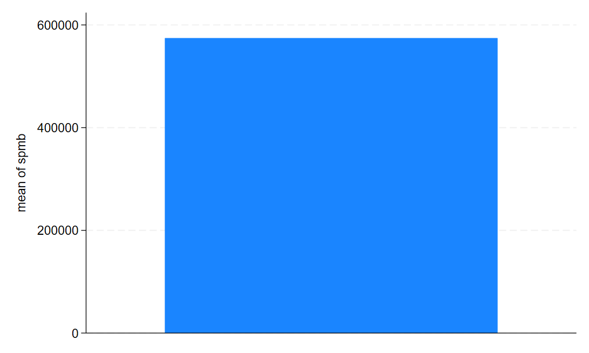
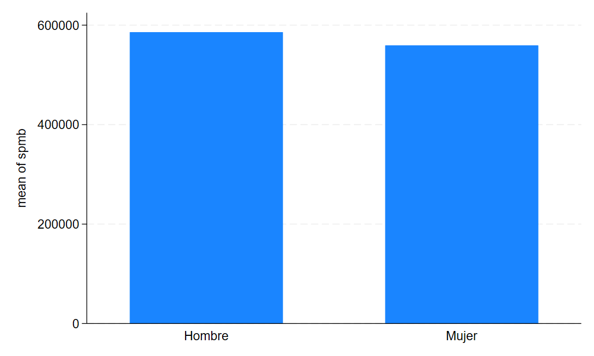
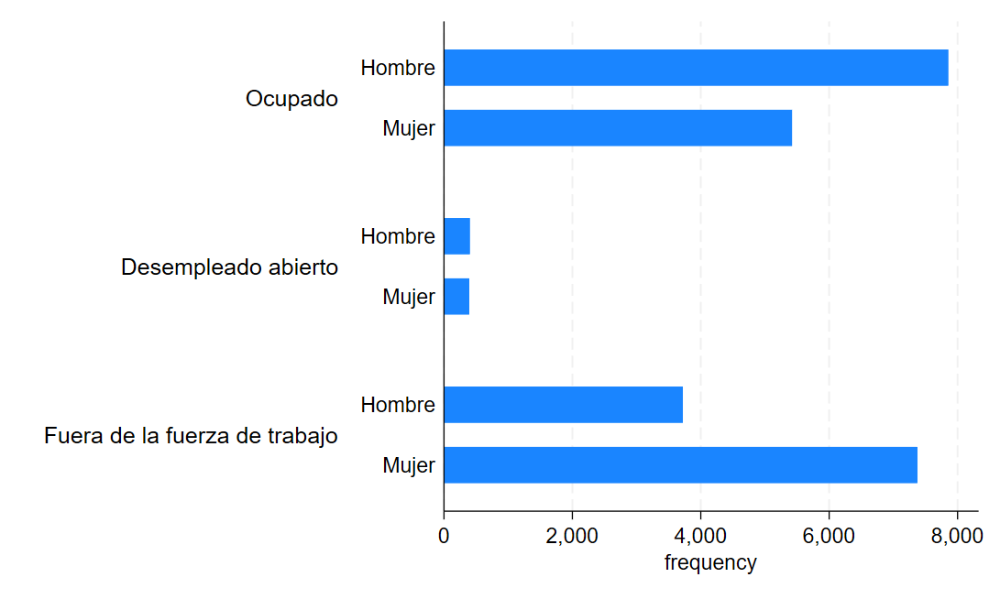
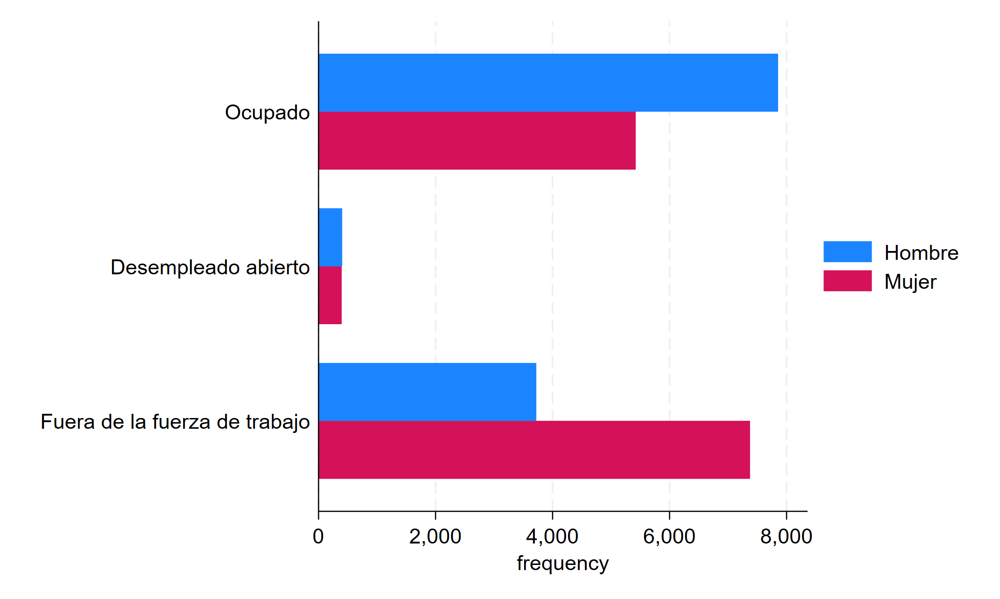
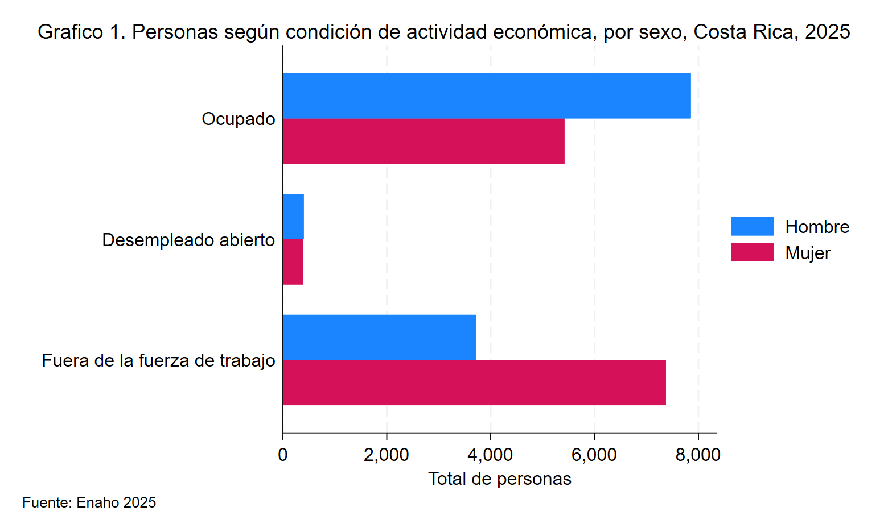
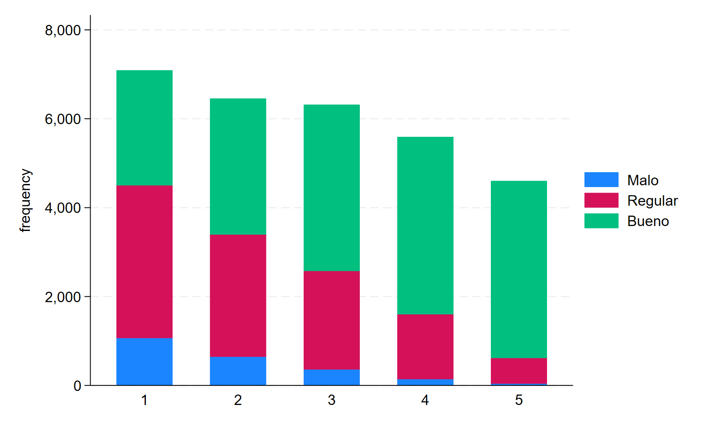
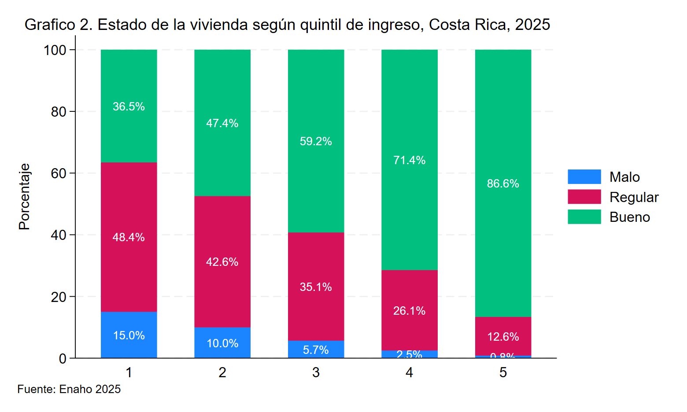
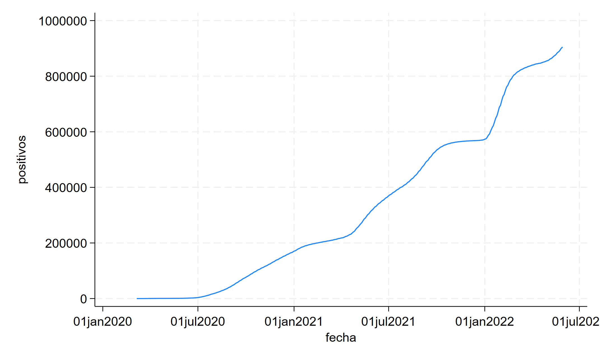
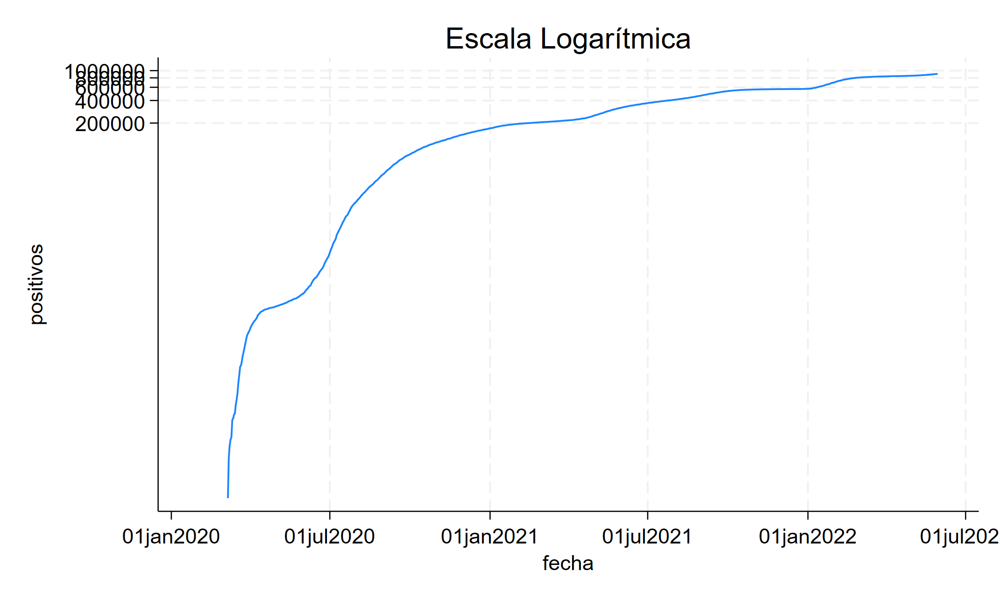
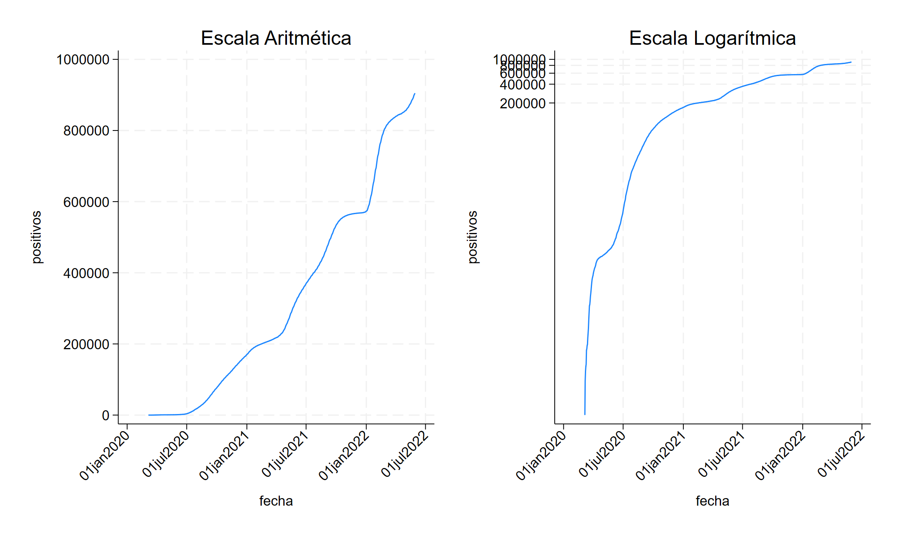

# Creación de Gráficos en Stata

[Descargar do-file](https://drive.google.com/uc?export=download&id=15ejBXVZSTEYmrNG33xVSelFSu2ljTrQf/view?usp=sharing)

[Descargar base de datos](https://drive.google.com/uc?export=download&id=1G76O7UJfJXsOFmjiZjy5dvqG_fakiTQ2)

---
En este laboratorio cubriremos la realización de gráficos en Stata.

En general, la syntaxis para crear gráficos es la siguiente

```stata title="Syntaxis"
graph [tipo de grafico], opciones
```

Sin embargo hay que adaptarla para los diferentes tipos de gráficos que hay. En este laboratorio, veremos como hacer gráficos de barras, gráficos de barras apiladas y gráficos de líneas.

<br>

---
### Gráficos de barras 
Para realizar un gráfico de barras lo hacemos de la siguiente forma:
```stata title="Syntaxis"
graph bar (funcion) variable, opciones
```

En este caso indicamos primero el tipo de gráfico usando `bar`. Además, cuando realizamos gráficos de barras tenemos que indicarle a Stata qué queremos que nos muestren las barras, indicándolo donde dice `(función)` y para esto tenemos varias opciones

!!! info "Posibles estadísticas" 

    - [x] mean - promedio
    - [x] count - recuento
    - [x] percent - porcentaje
    - [x] max - máximo
    
    Y muchas otras opciones que se pueden revisar en el menú de ayuda usando `help graph bar`

<br>

#### Ejemplo
Imagine que nos interesa conocer el salario promedio de las personas costarricenses según el sexo hombre o mujer.

En este caso, la variable que vamos a usar es `spmb` (Salario principal monetario bruto) y la función sería `mean` que corresponde al promedio
```stata title="Ejemplo - salario promedio"
graph bar (mean) spmb, over(A4)
```
??? info "Resultado"
    

Como puede ver el gráfico nos muestra una única barra que representa el salario promedio de las personas costarricenses. Sin embargo, no es de mucha utilidad usar un gráfico de barras para ver un único número, sino que nos interesa **comparar varias categorías**.

<br>

---
#### Agregar categorías
Podríamos entonces usar el gráfico de barras para comparar el salario promedio entre hombres y mujeres. Esto implica que debemos agrupar los datos por sexo.

Para lograr esto, vamos a hacer uso de las opciones, en particular de la opción `over`

!!! danger "Over"
    Over permite agrupar los datos según categorías

```stata title="Grafico de barras con categorías"
graph bar (mean) spmb, over(A4) // Salario promedio agrupando por sexo
```



<br>

---
#### Gráficos con leyenda
Suponga que ahora nos interesa visualizar la cantidad de personas ocupadas según su condición laboral, la cual puede ser (ocupada, desempleada o fuera de la fuerza de trabajo)

En este caso vamos a usar un gráfico de barras __horizontales__, por lo que usamos `hbar` y la función `count` para contar el total de personas según su condición laboral.

```stata title="Gráfico de barras horizontales"
graph hbar (count), over(A4) over(CondAct) // grafico de barras
// horizontales sin leyenda
```
??? info "Resultado"
    

Al observar el gráfico, note que se visualizaría mejor usando colores diferentes según sexo en lugar de tener más barras. Para esto agregamos la opción `asyvars` al final.

!!! danger "asyvars"
    La opción asyvars nos permite usar como leyenda la variable en el primer over() en este caso A4

```stata title="Gráfico con leyenda"
graph hbar (count), over(A4) over(CondAct) asyvars // asyvars 
// hace que el gráfico separe la variable A4 (sexo) por color
```



Finalmente, note que el gráfico que tenemos está incompleto, pues le faltan varias partes como:

- Título
- Títulos de eje
- Número de gráfico
- Fuente 

Cada parte del gráfico la podemos agregar con las siguientes opciones

| Parte | Opción de Stata |
|:------:|:----------:|
| __Título__ | `title("Aqui va el título")` |
| __Títulos de eje__ | `xtitle("Titulo eje x")` <br> `ytitle("Titulo eje y")` |
|__Leyenda__| `legend(label(1 "Hombre") label(2 "Mujer"))` |
| __Fuente__ | `note("Fuente:...")` |

```stata title="Gráfico con todos sus elementos"
graph hbar (count), over(A4) over(CondAct) asyvars ////
title("Grafico 1. Personas según condición de actividad económica, por sexo, Costa Rica, 2025", size(medium) span) ///
ytitle("Total de personas") ///
note("Fuente: Enaho 2025", span) ///
legend(label(1 "Hombre") label(2 "Mujer"))
```



---

### Gráficos de barras apiladas 100%

Un gráfico de barras apiladas se genera igual que un gráfico de
barras añadiendo la opción `stack`.

#### Con valores absolutos

Por ejemplo, suponga que queremos generar un gráfico de barras apiladas que muestre el estado de la vivienda según el quintil de ingreso

```stata title="Gráfico de barras apiladas"
graph bar (count), over(EFI) over(Q_IPCN) asyvars stack
```


#### Con porcentajes
Si queremos mostrar las barras como porcentaje, simplemente añadimos la opción `percentage`

```stata title="Gráfico de barras apiladas - porcentaje"
graph bar (count), over(EFI) over(Q_IPCN) asyvars stack percentage ///
blabel(bar, size(small) position(center) format(%2.1f) suffix("%") color(white)) /// // blabel permite añadir los porcentajes a cada barra 
title("Grafico 2. Estado de la vivienda según quintil de ingreso, Costa Rica, 2025", size(medium) span place(left)) ///
ytitle("Porcentaje") xtitle("Quintil de ingreso") ///
note("Fuente: Enaho 2025", span)
```


---

### Gráficos de líneas

Para este ejemplo vamos a tomar los datos de número de casos positivos de COVID durante la pandemia

[Descargar archivo](https://drive.google.com/uc?export=download&id=1uECW4mhivb36s3SZa_vDTDEknQYKeBTK)

El archivo cuenta con la fecha y el número de casos positivos acumulado. Este es un caso ideal para usar un gráfico de líneas, ya que tenemos una serie de tiempo.

Para realizar gráficos de líneas en Stata usamos la siguiente syntaxis

```stata title="syntaxis"
graph twoway line variable fecha, opciones
```

En nuestro caso, el ejemplo quedaría de la siguiente forma

```stata title="Gráfico de líneas"
graph twoway line positivos fecha
```



El gráfico nos muestra un rápido crecimiento en la cantidad de casos positivos de COVID durante los años de la pandemia

!!! warning "Escala semilogarítmica"
    Si quisiéramos determinar el ritmo al que crecían los contagios (si era creciente, decreciente o se mantenía constante), entonces podemos usar un gráfico con escala `semi-logarítmica`

Para hacer un gráfico con escala semi-logarítmica, simplemente usamos la opción `yscale(log)`

```stata
graph twoway line positivos fecha, title("Escala Logarítmica") yscale(log)
```



Finalmente podemos combinar gráficos usando graph combine

```stata
*Guardar grafico de lineas
graph twoway line positivos fecha, title("Escala Aritmética") ///
xlabel(#6, angle(45)) saving(aritmetico, replace)

*Guardar grafico de lineas con escala logaritmica
graph twoway line positivos fecha, title("Escala Logarítmica") yscale(log) 
xlabel(#6, angle(45)) saving(logaritmico, replace)

*Combinar ambos graficos y ver ritmo de crecimiento
graph combine aritmetico.gph logaritmico.gph
graph export "combinado.png"
```



¿Qué puede concluir acerca de la tasa de crecimiento de casos positivos?
