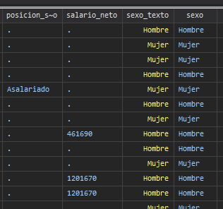

## Comandos

Los economistas están interesados en estudiar diferentes problemas sociales, para lo cual sus principales fuentes de información son las encuestas nacionales, como la ENAHO, ECE y ENIGH.

En estas bases de datos es común encontrar variables categóricas donde se usan números y se añade una etiqueta para indicar lo que significa.

!!! info "Ventajas"
    - [x] La computadora maneja los números de forma más eficiente
    - [x] Se asegura consistencia de las encuestas entre años


Sin embargo, dependiendo del usuario, puede ser mejor trabajar con el texto en lugar de su valor numérico.

<br>

---
### decode

`decode` nos permite convertir una variable numérica con etiquetas como sexo, a una variable cuyos valores sean el texto
```stata title="decode"
decode sexo, gen(sexo_texto)
```


Esto puede cambiar la forma en la que escribimos condiciones, por ejemplo

```stata
*Si queremos contar la cantidad de hombres
*Para la variable sexo usamos
count if sexo==1

*Para la variable sexo_texto usamos
count if sexo_texto=="Hombre"
```

<!-- !!! info "Etiquetas"
    Las etiquetas suelen ser útiles porque nos evitan errores al escribir condiciones, los números se pueden usar para ordenar categorías y -->

<br>

---
### encode
`encode` es el caso contrario, en este más bien nos interesa pasar de una variable con texto a una variable categórica con números y etiquetas

!!! info "Ventajas"
    Usar códigos numéricos también es útil para ordenar las categorías y puede simplificar la creación de nuevas variables

Imagine por ejemplo que nos interesa comparar el ingreso promedio de personas con bachillerato vs personas sin bachillerato

Sería útil generar una variable que nos indique si la persona tiene bachillerato

Podemos usar la variable nivel_educacion, sin embargo, eso implica escribir muchas condiciones

```stata
gen bachillerato = 1 if nivel_educacion=="Primaria Completa" | nivel_educacion=="Primaria Incompleta" ...
```

Escribir la condición en este caso se vuelve complicado, por lo que podemos usar `encode` para simplificarlo

```stata title="encode"
*Podemos primero definir la etiqueta
label define educacion ///
0 "Ninguno" ///
1 "Primaria incompleta" ///
2 "Primaria completa" ///
3 "Secundaria incompleta" ///
4 "Secundaria completa" ///
5 "Universitario sin título" ///
6 "Universitario con título" ///
9 "No especificado", replace

*Luego generar una nueva variable que use la etiqueta creada
encode niv_educativo, gen(educacion_cat) label(educacion)
```

Luego de esto veremos que la variable se convierte en categórica; podemos además ver más información usando `codebook`

<br>

---
### codebook
`codebook` permite ver información adicional sobre una variable, en este caso se puede usar para ver los valores de las etiquetas y el código numérico, así como las frecuencias y las observaciones perdidas.

```stata
codebook educacion_cat
```

??? success "Resultado"
    ```stata
                  type:  numeric (long)
                 label:  educacion

                 range:  [0,9]                        units:  1
         unique values:  8                        missing .:  4,839/22,142

            tabulation:  Freq.   Numeric  Label
                           599         0  Ninguno
                         1,872         1  Primaria incompleta
                         4,107         2  Primaria completa
                         3,957         3  Secundaria incompleta
                         3,306         4  Secundaria completa
                           979         5  Universitario sin título
                         2,476         6  Universitario con título
                             7         9  No especificado
                         4,839         .  
    ```
Ahora podríamos verificar la condición usando recode

<br>

---
### recode
`recode` nos permite recodificar los valores de una variable. Por ejemplo, para este caso podríamos decirle que los agrupe en 2 categorías según el nivel académico

```stata title="recode"
*Es posible usar replace o generate
recode (valor_viejo = valor_nuevo), gen(nueva_variable)
```

```stata title="Ejemplo"
*(4/6=0) significa reemplace todos los valores del 4 al 6 por un 0
recode educacion_cat (0/3=0) (4/6=1), gen(bachillerato)
replace bachillerato=. if bachillerato==9
```

Ahora podemos calcular el salario neto promedio
```stata title="Promedios"
*Bachillerato o mas
mean if bachillerato==1
*Menos de bachillerato
mean if bachillerato==0
```

??? success "Resultado"
    ```stata
        . mean salario_neto if bachillerato==1

        Mean estimation                   Number of obs   =      2,866

        --------------------------------------------------------------
                    |       Mean   Std. Err.     [95% Conf. Interval]
        -------------+------------------------------------------------
        salario_neto |   555876.2   6915.001      542317.3    569435.1
        --------------------------------------------------------------

        . *Menos de bachillerato
        . mean salario_neto if bachillerato==0

        Mean estimation                   Number of obs   =      2,537

        --------------------------------------------------------------
                    |       Mean   Std. Err.     [95% Conf. Interval]
        -------------+------------------------------------------------
        salario_neto |   300454.8   2684.664      295190.4    305719.1
        --------------------------------------------------------------
    ```


<br>
## Tablas

Llegados a este punto ya estamos familiarizados con el uso de STATA, por lo que podemos enfocarnos en analizar los datos que tenemos usando tablas y gráficos.

---
### tab

`tab` es el comando que se usa para generar la mayoría de tablas en STATA

Su syntaxis es muy simple, solamente se debe de especificar las variables que queremos incluir en la tabla

```stata title="Ejemplo"
tab educacion_cat 
```

??? success "Resultado"
    ```stata
                Nivel educativo |      Freq.     Percent        Cum.
    -------------------------+-----------------------------------
                    Ninguno |        599        3.46        3.46
        Primaria incompleta |       1,872       10.82       14.28
        Primaria completa |         4,107       23.74       38.02
    Secundaria incompleta |         3,957       22.87       60.89
        Secundaria completa |       3,306       19.11       79.99
    Universitario sin título |        979        5.66       85.65
    Universitario con título |      2,476       14.31       99.96
            No especificado |          7        0.04      100.00
    -------------------------+-----------------------------------
                    Total |         17,303      100.00

    ```

Como podemos ver en el resultado, STATA despliega una tabla que nos indica la cantidad de observaciones, el valor en términos porcentuales y una columna adicional llamada cum, que se refiere al porcentage acumulado.


Esto nos permite de forma muy clara y concisa responder preguntas como por ejemplo, ¿Qué porcentage de la población cuenta con un grado equivalente o superior a secundaria completa?

<br>

---
### tab con 2 variables

También es posible agregar 2 variables a la tabla, en este caso la primera será la variable que sale en las filas y la segunda la que sale en las columnas

```stata title="Ejemplo"
tab educacion_cat sexo
```

??? success "Resultado"
    ```stata
                            |         Sexo
            Nivel educativo |    Hombre      Mujer |     Total
        ----------------------+----------------------+----------
                    Ninguno |       290        309 |       599 
        Primaria incompleta |       860      1,012 |     1,872 
            Primaria completa |     1,981      2,126 |     4,107 
        Secundaria incompleta |     1,956      2,001 |     3,957 
        Secundaria completa |     1,497      1,809 |     3,306 
        Universitario sin tít |       446        533 |       979 
        Universitario con tít |       978      1,498 |     2,476 
            No especificado |         4          3 |         7 
        ----------------------+----------------------+----------
                        Total |     8,012      9,291 |    17,303 
    ```


Sin embargo, esta tabla no muestra las distribuciones en porcentaje, por lo que no es posible comparar la educación entre grupos. Para evitar esto se pueden usar las opciones `col` o `row`, para resumir los valores como porcentaje de la columna o fila.

```stata title="Porcentajes"
tab educacion_cat sexo, col
```

??? success "Resultado"
    ```stata
                                |         Sexo
        Nivel educativo |    Hombre      Mujer |     Total
    ----------------------+----------------------+----------
                Ninguno |       290        309 |       599 
                        |      3.62       3.33 |      3.46 
    ----------------------+----------------------+----------
    Primaria incompleta |       860      1,012 |     1,872 
                        |     10.73      10.89 |     10.82 
    ----------------------+----------------------+----------
        Primaria completa |     1,981      2,126 |     4,107 
                        |     24.73      22.88 |     23.74 
    ----------------------+----------------------+----------
    Secundaria incompleta |     1,956      2,001 |     3,957 
                        |     24.41      21.54 |     22.87 
    ----------------------+----------------------+----------
    Secundaria completa |     1,497      1,809 |     3,306 
                        |     18.68      19.47 |     19.11 
    ----------------------+----------------------+----------
    Universitario sin tít |       446        533 |       979 
                        |      5.57       5.74 |      5.66 
    ----------------------+----------------------+----------
    Universitario con tít |       978      1,498 |     2,476 
                        |     12.21      16.12 |     14.31 
    ----------------------+----------------------+----------
        No especificado |         4          3 |         7 
                        |      0.05       0.03 |      0.04 
    ----------------------+----------------------+----------
                    Total |     8,012      9,291 |    17,303 
                        |    100.00     100.00 |    100.00 

    ```

<br>

---
### sum
Las tablas son muy útiles para analizar variables categóricas, pero qué pasa cuando variable es numérica, como por ejemplo el salario neto. En este caso es conveniente hacer un resumen estadístico de la variable

`sum` nos permite de manera rápida, calcular estadísticas acerca de la variable que nos interesa

```stata title="Ejemplo"
sum salario_neto
```
??? success "Resultado"
    ```stata
        Variable |        Obs        Mean    Std. Dev.       Min        Max
        -------------+---------------------------------------------------------
        salario_neto |      5,407    435961.7    312211.8      10000    3900000

    ```

En el resultado se puede observar la cantidad de observaciones, el valor promedio, la desviación estándar y los valores máximos y mínimos.

<br>

## Gráficos

Por último, podemos ver ahora 2 tipos de gráficos que son útiles para analizar la distribución de variables numéricas

---
### histograma

Un histograma es un gráfico muy común para analizar distribuciones de datos, permite ver por ejemplo la distribución de los ingresos de las personas, los años de escolaridad y otras variables similares

```stata title="Histograma"
*Frequency es necesario para que muestre frecuencias
hist amos_educacion, frequency
```

Usando `by` también se tiene la posibilidad de crear gráficos dividiendo por alguna otra característica, por ejemplo un histograma de los años de escolaridad por zona

```stata title="Ejemplo"
hist amos_educacion, by(zona) frequency
```

<br>

---
### gráfico de cajas

Por último se tiene el gráfico de cajas, que nos indica la distribución en cuartiles de alguna variable

En este caso se realiza un gráfico de cajas para analizar la variable salario neto

```stata title="Grafico de cajas y bigotes"
graph box salario_neto
```
En principio el gráfico se ve mal, ya que hay valores muy altos de salario que afectan la escala, si fuera posible excluir estos valores entonces se puede usar la opción `nooutsides`

```stata title="Grafico de cajas y bigotes"
graph box salario_neto, nooutsides
```

De igual manera se puede dividir el análisis por grupos. Se puede por ejemplo comparar la distribución del salario de las personas según si tienen o no título de bachillerato

```stata title="Ejemplo"
graph box salario_neto, over(bachillerato) nooutsides
```