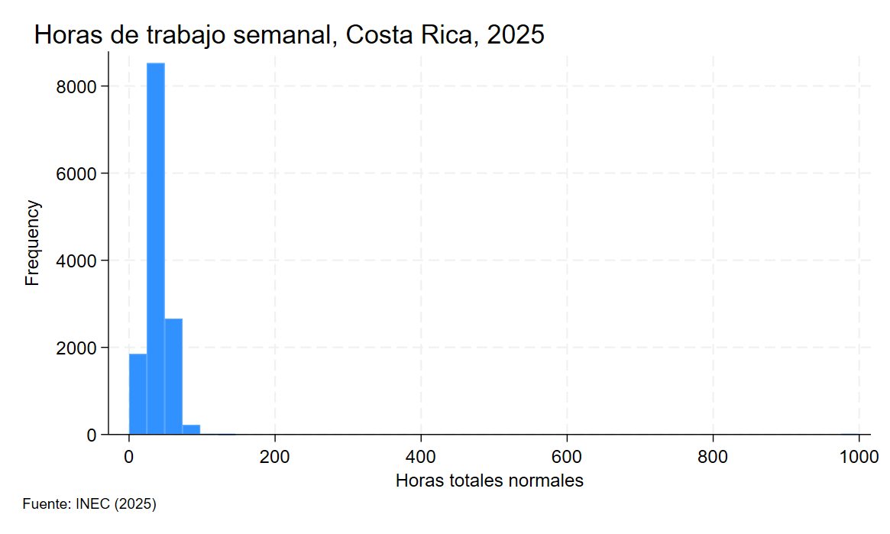

# Medidas de dispersión y forma


## Cargar datos

```stata
import spss "ruta del archivo", clear
rename *, lower()
```


---
## Varianza dentro y entre grupos

Para este ejercicio trataremos de estimar la variabilidad dentro y entre grupos de las horas trabajadas entre hombres y mujeres.

Al igual que en ejercicios anteriores, lo primero y más importante siempre es __asegurarse de limpiar los datos antes de realizar cualquier análisis__

Para esto podemos empezar por hacer un histograma y tabular los datos de las horas trabajadas por semana, variable `hortotnorm`

```stata
histogram hortotnorm, frequency
```


Note que en el histograma tenemos valores cercanos a mil, lo cual no tiene sentido, pues implicaría que hay personas que trabajan mil horas a la semana

Podemos comprobar esto viendo los valores mínimos y máximos con `summarize`

```stata
summarize hortotnorm, detail
```

!!! info "Resultado"
    ```stata
                    Horas totales normales
    -------------------------------------------------------------
        Percentiles         Smallest
    1%             1              0
    5%            10              0
    10%           20              0       Obs              13,275
    25%           40              0       Sum of wgt.      13,275

    50%           48                      Mean           43.24008
                            Largest       Std. dev.      28.12638
    75%           48            999
    90%           60            999       Variance       791.0931
    95%           68            999       Skewness       23.55561
    99%           84            999       Kurtosis       804.0196

    ```

```stata title="Limpiar valores no reportados"
drop if inlist(hortotnorm, 0,999)

>> (136 observations deleted)
```

!!! info "Resultado"
    ```stata
                    Horas totales normales
    -------------------------------------------------------------
        Percentiles      Smallest
    1%            5              1
    5%           12              1
    10%           20              1       Obs              13,139
    25%           40              1       Sum of wgt.      13,139

    50%           48                      Mean           43.07938
                            Largest       Std. dev.      14.99351
    75%           48             99
    90%           60            108       Variance       224.8053
    95%           68            112       Skewness      -.3558878
    99%           84            126       Kurtosis       4.072578

    ```

Una vez que limpiamos los datos podemos proceder con el análisis de la varianza

### oneway

>El comando `oneway` nos permite descomponer la variabilidad en 2 componentes, uno correspondiente a diferencias entre grupos y otro correspondiente a diferencias dentro de cada grupo

```stata title="Cálculo de la varianza dentro y entre grupos"
oneway hortotnorm a4
```

!!! info "Resultado"
    ```stata
                            Analysis of variance
        Source              SS         df      MS            F     Prob > F
    ------------------------------------------------------------------------
    Between groups      139142.125      1   139142.125    649.50     0.0000
    Within groups       2814350.08  13137   214.230805
    ------------------------------------------------------------------------
        Total            2953492.2  13138   224.805313
    ```

El comando `oneway` nos devuelve las desviaciones divididas entre grupos y dentro de grupos. Para acceder a los atributos podemos ver la lista de variables con `return list`

### return list
> Cuando corremos diferentes comandos como summarize, oneway y muchos más, `Stata` nos permite acceder a los resultados usando `r(el dato que queremos)`. La lista de datos disponibles la podemos ver con `return list`

```stata title="Ver datos disponibles"
return list
```

```stata
scalars:
                  r(N) =  13139
                r(mss) =  139142.1245317645
               r(df_m) =  1
                r(rss) =  2814350.080050015
               r(df_r) =  13137
                  r(F) =  649.4963447977681
           r(chi2bart) =  47.69748789196146
            r(df_bart) =  1

matrices:
              r(ANOVA) :  3 x 5
```

En este caso nos interesan los siguientes datos

| Entrada 	| Significado                           	|
|---------	|---------------------------------------	|
| `rss`     	| suma de desviaciones dentro de grupos 	|
| `mss`     	| suma de desviaciones entre grupos     	|
| `N`       	| Numero de observaciones               	|

```stata title="Guardar resultados"
scalar suma_var_dentro = r(rss) // Suma de desviaciones dentro de cada grupo
scalar suma_var_entre = r(mss) // Suma de desviaciones entre grupos
scalar N = r(N) // Total de observaciones
```

```stata
// Calculamos la varianza total
summarize hortotnorm, detail
scalar var_total = r(Var)
```

Note que la suma de las desviaciones no corresponde a la varianza aún, recuerde que la fórmula se escribe como 

$$
\sigma^2 = \frac{\sum_i {N_i \sigma_i^2}}{N} + \frac{\sum_i{N_i(\mu_i-\mu)^2}}{N}
$$

!!! Warning "Cuidado"
    Tenemos la parte de arriba de cada fracción (la suma de las desviaciones), pero aún nos falta dividir entre el total de observaciones

```stata
// Calculamos la varianza dentro y entre e interpretamos (recuerde que la 
// varianza entre indica cuanta de la variabilidad en el tamaño de los hogares es explicada por la condición de pobreza)
scalar var_dentro = suma_var_dentro/N
scalar var_entre = suma_var_entre/N
display "Varianza dentro -> " var_dentro
display "Varianza entre -> " var_entre
```

```stata title="Resultado"
Varianza dentro -> 214.19819
Varianza entre -> 10.590009
```

Note que la suma corresponde a la varianza total

??? info "Varianza poblacional"
    ```stata
                    Horas totales normales
    -------------------------------------------------------------
         Percentiles       Smallest
    1%             5              1
    5%            12              1
    10%           20              1       Obs              13,139
    25%           40              1       Sum of wgt.      13,139

    50%           48                      Mean           43.07938
                            Largest       Std. dev.      14.99351
    75%           48             99
    90%           60            108       Variance       224.8053
    95%           68            112       Skewness      -.3558878
    99%           84            126       Kurtosis       4.072578
    ```


Finalmente, podemos calcular la razón de determinación para determinar que porcentaje de la variabilidad en las horas de trabajo puede ser explicado por diferencias entre hombres y mujeres

```stata
// Razón de determinación
display "Varianza entre / Varianza Total -> " var_entre/var_total
```
```stata title="Resultado"
Varianza entre / Varianza Total -> .04710747
```

Esto significa que un 4% de la variabilidad en las horas de trabajo puede ser explicada por diferencias entre las horas de trabajo de hombres y mujeres

<br>

---
## Coeficiente de variación

### cv2

>`cv2` nos permite calcular el coeficiente de variación para una variable. Este indica cuánto representa la desviación estándar relativo al promedio de la variable y permite comparar variabilidad de dos distribuciones.

Por ejemplo, si quisiéramos comparar cuál distribución es más variable, si la distribución de horas trabajadas por hombres o mujeres, podríamos hacerlo de la siguiente forma

```stata title="cv2"
bysort a4: cv2 hortotnorm
```

```stata title="Resultado"
----------------------------------------------------------------------------------------------------------------------------------------------
-> a4 = H

 Variable   | Coefficient of Variation
------------+-------------------------
 hortotnorm | .30804719

----------------------------------------------------------------------------------------------------------------------------------------------
-> a4 = M

 Variable   | Coefficient of Variation
------------+-------------------------
 hortotnorm | .3925612
```

!!! Danger "Comparación"
    Es preferible usar números relativos (como el coeficiente de variación) para comparar la variabilidad, pues las desviaciones estándar no son directamente comparables si las distribuciones tienen promedios distintos.

    No es lo mismo una desviación estándar de 10 si en promedio las personas trabajan 20 horas a una desviación estándar de 10 si en promedio las personas trabajan 40 horas


<br>

---
## Coeficiente de asimetría
>El coeficiente de asimetría mide si una distribución está tiene una cola más pesada a la derecha o izquierda de la distribución.
>
>Permite ver si los datos son simétricos o si existe una cola más larga en alguno de los lados.
>
> - Asimetría > 0 - asimetría positiva, valores altos lejos del resto de la distribución
> - Asimetría = 0 - distribución simétrica, no hay una cola más larga
> - Asimetría < 0 - asimetría negativa, valores bajos lejos del resto de la distribución

```stata title="Coeficiente de asimetría"
summarize hortotnorm, detail
```
```stata
                   Horas totales normales
-------------------------------------------------------------
      Percentiles      Smallest
 1%            5              1
 5%           12              1
10%           20              1       Obs              13,139
25%           40              1       Sum of wgt.      13,139

50%           48                      Mean           43.07938
                        Largest       Std. dev.      14.99351
75%           48             99
90%           60            108       Variance       224.8053
95%           68            112       Skewness      -.3558878
99%           84            126       Kurtosis       4.072578
```

El valor de la asimetría corresponde al campo llamado `Skewness`

<br>

---
## Coeficiente de curtosis

> El coeficiente de curtosis ayuda a ver qué tan **concentrada está una distribución alrededor de la media**
>
> * Coeficiente > 3 - distribución Leptocúrtica - valores concentrados cerca de la media, las colas tienen mayor importancia (valores extremos)
> * Coeficiente = 3 - distribución Mesocúrtica 
> * Coeficiente < 3 - distribución Platicúrtica - valores dispersos, las colas tienen menor peso (menos valores extremos)

```stata title="Coeficiente de curtosis"
summarize hortotnorm, detail
```
```stata
                   Horas totales normales
-------------------------------------------------------------
      Percentiles      Smallest
 1%            5              1
 5%           12              1
10%           20              1       Obs              13,139
25%           40              1       Sum of wgt.      13,139

50%           48                      Mean           43.07938
                        Largest       Std. dev.      14.99351
75%           48             99
90%           60            108       Variance       224.8053
95%           68            112       Skewness      -.3558878
99%           84            126       Kurtosis       4.072578
```

En la tabla, el coeficiente de curtosis es indicado en el campo `Kurtosis`


---
## Regla empírica y Teorema de Chebyshev

Con base en la distribución de horas de trabajo, mostrada anteriormente

- Indique según su criterio si sería posible usar la regla empírica para determinar el intervalo que contiene el 96% de los datos

- Usando el teorema de Chebyshev, indique el intervalo que contiene al menos el 75% de las observaciones

<!-- ---
## Gráficos de cajas

Por último se tiene el gráfico de cajas, que nos indica la distribución en cuartiles de alguna variable

En este caso se realiza un gráfico de cajas para analizar la variable salario neto

```stata title="Grafico de cajas y bigotes"
graph box salario_neto
```
En principio el gráfico se ve mal, ya que hay valores muy altos de salario que afectan la escala, si fuera posible excluir estos valores entonces se puede usar la opción `nooutsides`

```stata title="Grafico de cajas y bigotes"
graph box salario_neto, nooutsides
```

De igual manera se puede dividir el análisis por grupos. Se puede por ejemplo comparar la distribución del salario de las personas según si tienen o no título de bachillerato

```stata title="Ejemplo"
graph box salario_neto, over(bachillerato) nooutsides
``` -->